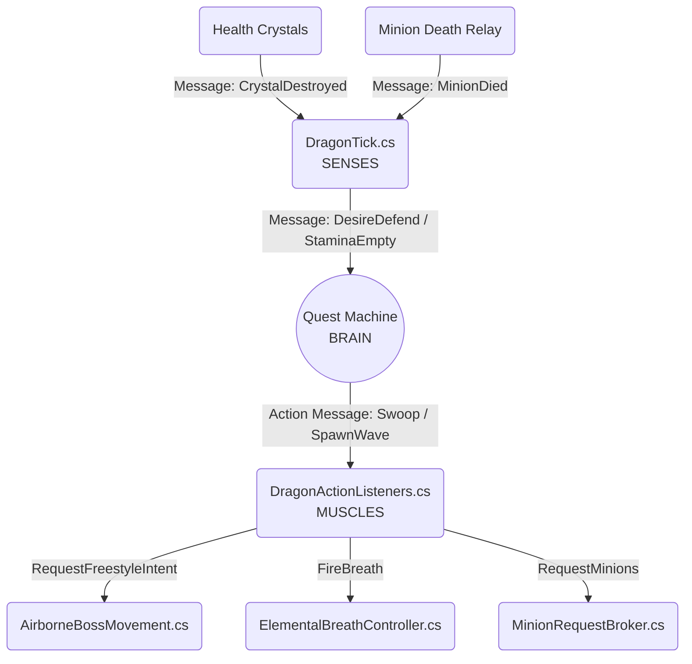

# Boss AI Integration Guide: Quest Machine Migration

This guide provides explicit, step-by-step instructions on how to upgrade the Boss Prefab and the level scene to use the new Quest Machine-based behavior tree architecture. This completely removes the old `BossEventBus` and shifts the logic to a completely decoupled Brain, Sense, and Muscle system.

---

## What is changing?

1. **The Event Bus is gone.** `BossEventBus.cs` has been deleted.
2. **The Brain.** We now use PixelCrushers' **Quest Machine** as a visual State Machine (Behavior Tree).
3. **The Senses.** `DragonTick.cs` runs a 10Hz loop, monitoring the boss stats and evaluating desires. It sends `MessageSystem` messages to the Brain.
4. **The Muscles.** `DragonActionListeners.cs` listens for commands from the Brain and executes physical code (moving, shooting breath). It has zero update loops.

---

## Step 1: Generate the Brain

Before setting up the prefab, we need to generate the actual Quest asset.

1. Open Unity.
2. On the top menu bar, click **Archery Range** -> **Generate Dragon Brain Quest**.
3. Unity will generate a file called `DragonBrain_Automated.asset` in the root `Assets/` folder.
4. You can open the Quest Editor window and inspect this asset. It visually represents the state machine.

---

## Step 2: Upgrade the Dragon Prefab

We need to add the new scripts to the main boss prefab and wire them up.

Open the `Boss_AsianFireDragonNew` prefab.

### Component 1: `Quest Journal`
1. Select the Root Object (`Boss_AsianFireDragonNew`).
2. Click **Add Component** -> **Quest Journal**.
3. Leave all default settings.

### Component 2: `Dragon Brain Controller`
1. Select the Root Object.
2. Click **Add Component** -> **Dragon Brain Controller**.
3. In the Inspector, locate the **Dragon Brain Asset** field.
4. Drag and drop the `DragonBrain_Automated.asset` (generated in Step 1) into this field.

### Component 3: `Dragon Tick`
1. Select the Root Object.
2. Click **Add Component** -> **Dragon Tick**.
3. The `Brain` field should automatically populate with the `BossCreature` script on the prefab. If not, drag the Root Object into this field.
4. Set **Updates Per Second** to `10`.

### Component 4: `Dragon Action Listeners`
1. Select the Root Object.
2. Click **Add Component** -> **Dragon Action Listeners**.
3. No configuration needed! It automatically finds the movement and breath components via `Awake()`.

### The Final Prefab Hierarchy

Your prefab root should now contain these exact components:

```text
Boss_AsianFireDragonNew
|-- Transform
|-- Spline Follower
|-- Airborne Boss Movement
|-- Boss Creature
|-- Creature Status Effects
|-- Segmented Dragon Manager
|-- Regenerator Controller
|-- Dragon Spacing Manager
|-- Elemental Breath Controller
|-- Quest Journal (NEW)
|-- Dragon Brain Controller (NEW)
|-- Dragon Tick (NEW)
|-- Dragon Action Listeners (NEW)
```

---

## Step 3: Upgrade the Level Scene

Because we deleted `BossEventBus.cs`, we must clean it up from the scene.

1. Open your main game scene (e.g., `_LevelProgression_NEW`).
2. Locate the GameObject that held the `BossEventBus` script.
3. Remove the `BossEventBus` component (Right-click -> Remove Component).
4. No other changes are needed for the environment! `HealthCrystal` and `MinionDeathRelay` have been updated internally to send PixelCrushers messages instead.

---

## Mermaid Visualizer

Here is a visual representation of how the new architecture flows:



You are now ready to hit Play and test the Quest Machine Brain!
