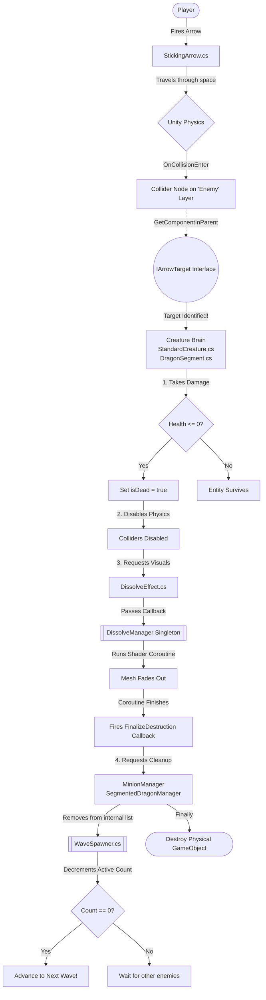

# Decoupled Combat Architecture Guide

> [!info] The Architectural Goal
> In earlier versions, visual effect scripts (like `DissolveEffect`) were acting as a "middleman," intercepting arrow hits and managing health logic. This created rigid, hard-to-maintain code that broke physics interactions.
>
> The new architecture enforces strict **Decoupling**. Visual effects, Combat Logic, and Physics are entirely separated. Entities (like Minions and Bosses) are now "Facilitators." They manage their own health natively and simply send *messages* to Managers when tasks need to be performed.

---

## The Complete Player Experience Flow
This flowchart traces the exact chain of events chronologically from top to bottom. It shows exactly how an arrow shot translates into a wave progressing.

---

## Step-by-Step Breakdown
If you prefer reading the exact chronological steps, here is the flow broken down by class responsibility:

### Phase 1: The Shot (Physics)
1. **The Player** shoots an arrow.
2. **`StickingArrow.cs`** flies through the air until Unity Physics detects an `OnCollisionEnter`.
3. The arrow specifically looks for objects on the `Enemy` layer.
4. The arrow asks the object it hit: *"Do you have the `IArrowTarget` interface?"*

### Phase 2: Combat Resolution (The Facilitators)
5. Because we decoupled the logic, `DissolveEffect.cs` no longer intercepts the hit.
6. Instead, the hit passes directly to the **Creature Brain** (`StandardCreature.cs` for minions, or `DragonSegment.cs` for bosses).
7. The brain calls `TakeDamage()`.
8. If health drops to 0, the brain sets `isDead = true` to prevent double-kills and instantly turns off its colliders so arrows pass through.

### Phase 3: Visual Death (The Manager)
9. The brain commands its `DissolveEffect.cs` component to trigger.
10. `DissolveEffect.cs` sends its shader data (and a "call me back when you're done" message) to the **`DissolveManager`**.
11. The **`DissolveManager`** runs the 1-second coroutine, making the mesh fade out.
12. When finished, the Manager fires the callback back to the brain.

### Phase 4: Scene Cleanup (Wave Progression)
13. The brain receives the callback and says: *"I am visually dead. Tracking managers, please remove me."*
14. **`MinionManager`** or **`SegmentedDragonManager`** removes the entity from their active lists.
15. The tracker explicitly tells **`WaveSpawner.cs`** to decrement the active enemy count.
16. If the count reaches 0, the wave instantly advances.
17. Finally, the Tracker destroys the physical GameObject from the scene.

> [!tip] Universal Compatibility
> This flow is symmetric! Notice how both `StandardCreature` and `DragonSegment` share the exact same box in the flowchart? Because both natively implement `IArrowTarget`, the arrow doesn't care if it's hitting a swarm minion or the leg of the Dragon Boss. The exact same flow happens every single time.
