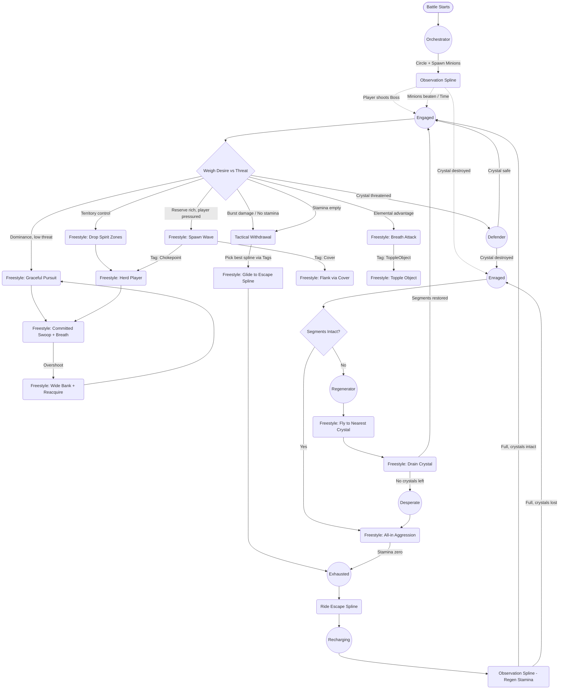

# Dragon AI Behavior Tree (Automated Setup)

> [!tip] ZERO MANUAL SETUP REQUIRED
> You do not need to look at the Inspector, add Actions to the Active state, or configure Conditions on the node blocks anymore!
>
> I have created an Editor Tool that will automatically build this entire Behavior Tree for you. It automatically creates every Node, writes all the Action strings, and properly places the Message conditions in the `Conditions` foldout (exactly as you showed me).
>
> **To generate the AI:**
> 1. In Unity, go to the very top menu.
> 2. Click exactly: **Archery Range -> Generate Dragon Brain Quest**
> 3. The script will create a new file named `DragonBrain_Automated` in your `Assets` folder and highlight it for you.
> 4. Simply drag this new `DragonBrain_Automated` asset into the `dragonBrainAsset` slot on your Boss Prefab's `DragonBrainController`.

---

> [!info] Visual Reference
> Below is the map of what the automated script generates behind the scenes. You do not need to build this manually anymore!

