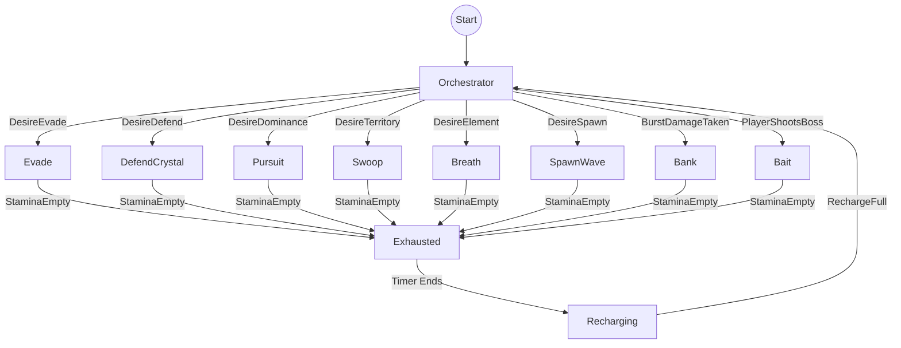

# Dragon AI Behavior Tree

> [!tip] Visual Node Graph
> Below is the exact map of how your nodes must connect in the Quest Machine Editor. Every box is a **Task Node**. Every arrow is a connection from a **Green (Success)** pin.

---

> [!info] Node Configuration Table
> Use this table as a checklist. For every node you create, look here to see exactly what to put in the `Conditions` and `Actions` panels in the Unity Inspector.

| Node Name | Connection (Green Pin -> Target) | Condition (Target: `Brain`) | Action (Target: `DragonActions`) |
| :--- | :--- | :--- | :--- |
| **Start** | `Orchestrator` | *(None)* | *(None)* |
| **Orchestrator** | `Evade` | Message: `DesireEvade` | *(None)* |
| | `DefendCrystal` | Message: `DesireDefend` | |
| | `Pursuit` | Message: `DesireDominance` | |
| | `Swoop` | Message: `DesireTerritory` | |
| | `Breath` | Message: `DesireElement` | |
| | `SpawnWave` | Message: `DesireSpawn` | |
| | `Bank` | Message: `BurstDamageTaken` | |
| | `Bait` | Message: `PlayerShootsBoss` | |
| **Evade** | `Exhausted` | Message: `StaminaEmpty` | Message: `Evade` |
| **DefendCrystal** | `Exhausted` | Message: `StaminaEmpty` | Message: `DefendCrystal` |
| **Pursuit** | `Exhausted` | Message: `StaminaEmpty` | Message: `Pursuit` |
| **Swoop** | `Exhausted` | Message: `StaminaEmpty` | Message: `Swoop` |
| **Breath** | `Exhausted` | Message: `StaminaEmpty` | Message: `Breath` |
| **SpawnWave** | `Exhausted` | Message: `StaminaEmpty` | Message: `SpawnWave` |
| **Bank** | `Exhausted` | Message: `StaminaEmpty` | Message: `Bank` |
| **Bait** | `Exhausted` | Message: `StaminaEmpty` | Message: `Bait` |
| **Exhausted** | `Recharging` | Timer: `5` Seconds | Message: `Exhausted` |
| **Recharging** | `Orchestrator` | Message: `RechargeFull` | Message: `Regenerate` |