# Dragon AI Behavior Tree (Consolidated Blueprint)

> [!danger] EXACT NODE TYPE TO USE
> **EVERY SINGLE NODE** in the graph below is a **Condition** node.
> *(Do not use "Task". Use "Condition" nodes because they evaluate the incoming message from `DragonTick` before passing Success).*
>
> To create one, you must click exactly:
> 1. **Right-Click** empty space in the Quest Editor.
> 2. Select **Add Node**.
> 3. Click **Condition**.

---

> [!tip] How to read this graph
> - All the data you need to type into the Unity Inspector is inside the box.
> - **Connections (Arrows)**: Just draw a line from the top node's **Green (Success) pin** to the node below it. No text goes on the connection itself.

```mermaid
flowchart TD
    Start(["Node: Start"]) --> Orch

    Orch(["Node: Orchestrator (Condition)"])

    Orch --> Obs
    Obs(["Node: Observation Spline (Condition)<br/>Condition: (Circle + Spawn Minions)"])

    Obs -.-> Engage_Shoots
    Engage_Shoots(["Node: Engaged (Condition)<br/>Condition: PlayerShootsBoss"])

    Obs -.-> Engage_Time
    Engage_Time(["Node: Engaged (Condition)<br/>Condition: Minions beaten / Time"])

    Obs -.-> Rage_Crystal
    Rage_Crystal(["Node: Enraged (Condition)<br/>Condition: Crystal destroyed"])

    Engage(["Node: Engaged (Condition)<br/>Action: Weigh Desire vs Threat"]) --> Pursue
    Engage --> Bait
    Engage --> Spawn
    Engage --> Breath
    Engage --> Defend
    Engage --> Evade_Dmg
    Engage --> Evade_Stamina

    Pursue(["Node: Pursue (Condition)<br/>Condition: DesireDominance<br/>Action: Pursuit"]) --> Swoop
    Swoop(["Node: Swoop (Condition)<br/>Action: Swoop"]) --> Bank
    Bank(["Node: Bank (Condition)<br/>Condition: SwoopOvershoot<br/>Action: Bank"]) --> Pursue

    Bait(["Node: Bait (Condition)<br/>Condition: DesireTerritory<br/>Action: Bait"]) --> Herd
    Herd(["Node: Herd (Condition)<br/>Action: Herd"]) --> Swoop

    Spawn(["Node: Spawn (Condition)<br/>Condition: DesireSpawn<br/>Action: SpawnWave"]) --> Herd_Choke
    Herd_Choke(["Node: Herd (Condition)<br/>Condition: TagChokepoint<br/>Action: Herd"])

    Spawn --> Flank
    Flank(["Node: Flank (Condition)<br/>Condition: TagCover<br/>Action: Flank"])

    Breath(["Node: Breath (Condition)<br/>Condition: DesireElement<br/>Action: Breath"]) --> Topple
    Topple(["Node: Topple (Condition)<br/>Condition: TagToppleObject<br/>Action: Topple"])

    Defend(["Node: Defender (Condition)<br/>Condition: DesireDefend<br/>Action: DefendCrystal"])
    Defend --> Engage_Safe
    Engage_Safe(["Node: Engaged (Condition)<br/>Condition: Crystal safe"])

    Defend --> Rage_Dest
    Rage_Dest(["Node: Enraged (Condition)<br/>Condition: Crystal destroyed"])

    Evade_Dmg(["Node: Evade (Condition)<br/>Condition: BurstDamageTaken<br/>Action: Evade"]) --> FlyEsc
    Evade_Stamina(["Node: Evade (Condition)<br/>Condition: StaminaEmpty<br/>Action: Evade"]) --> FlyEsc

    FlyEsc(["Node: Glide to Escape Spline (Condition)<br/>Action: (Pick best spline via Tags)"]) --> Exhaust

    Exhaust(["Node: Exhausted (Condition)<br/>Action: Ride Escape Spline"]) --> EscSpline
    EscSpline(["Node: EscSpline (Condition)<br/>Action: Ride Escape Spline"]) --> Recharge

    Recharge(["Node: Recharging (Condition)<br/>Action: Recharging"]) --> RechargeLoop
    RechargeLoop(["Node: RechargeLoop (Condition)<br/>Action: Observation Spline - Regen Stamina"])

    RechargeLoop --> Engage_Full
    Engage_Full(["Node: Engaged (Condition)<br/>Condition: RechargeFull"])

    RechargeLoop --> Rage_Lost
    Rage_Lost(["Node: Enraged (Condition)<br/>Condition: Crystals lost"])

    Rage(["Node: Enraged (Condition)<br/>Action: Rage"]) --> Relentless
    Rage --> Regen

    Relentless(["Node: Relentless (Condition)<br/>Condition: SegmentsIntact<br/>Action: Relentless"]) --> Exhaust_Rage
    Exhaust_Rage(["Node: Exhausted (Condition)<br/>Condition: StaminaEmpty<br/>Action: Evade"])

    Regen(["Node: Regenerator (Condition)<br/>Condition: SegmentsMissing<br/>Action: Regenerate"]) --> Seek
    Seek(["Node: Seek (Condition)<br/>Action: Fly to Nearest Crystal"]) --> Absorb
    Absorb(["Node: Absorb (Condition)<br/>Action: Drain Crystal"])

    Absorb --> Engage_Restored
    Engage_Restored(["Node: Engaged (Condition)<br/>Condition: Segments restored"])

    Absorb --> Desperate
    Desperate(["Node: Desperate (Condition)<br/>Condition: NoCrystalsLeft<br/>Action: Desperate"]) --> Relentless_Desp
    Relentless_Desp(["Node: Relentless (Condition)<br/>Action: Relentless"])
```

