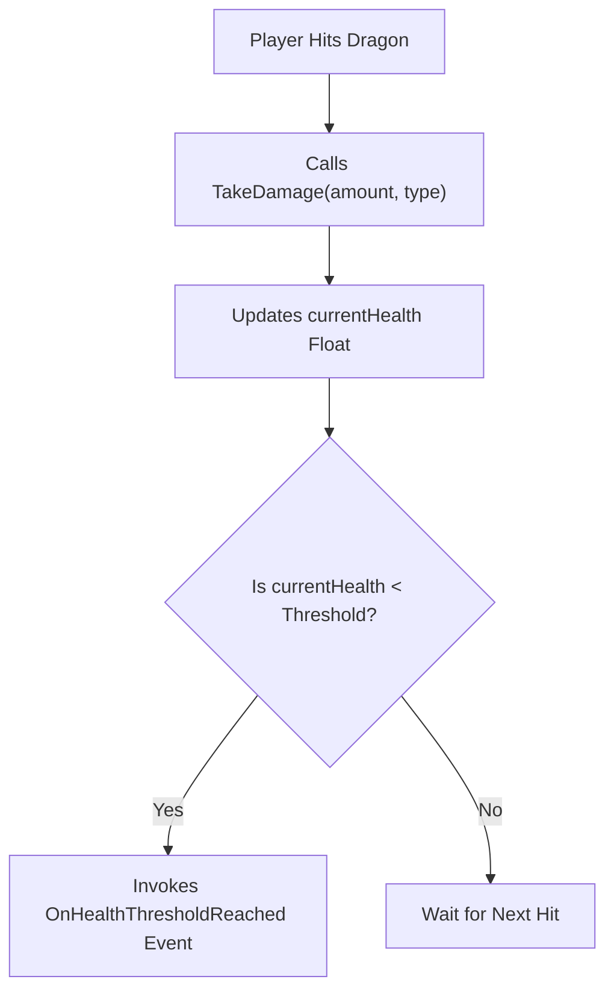
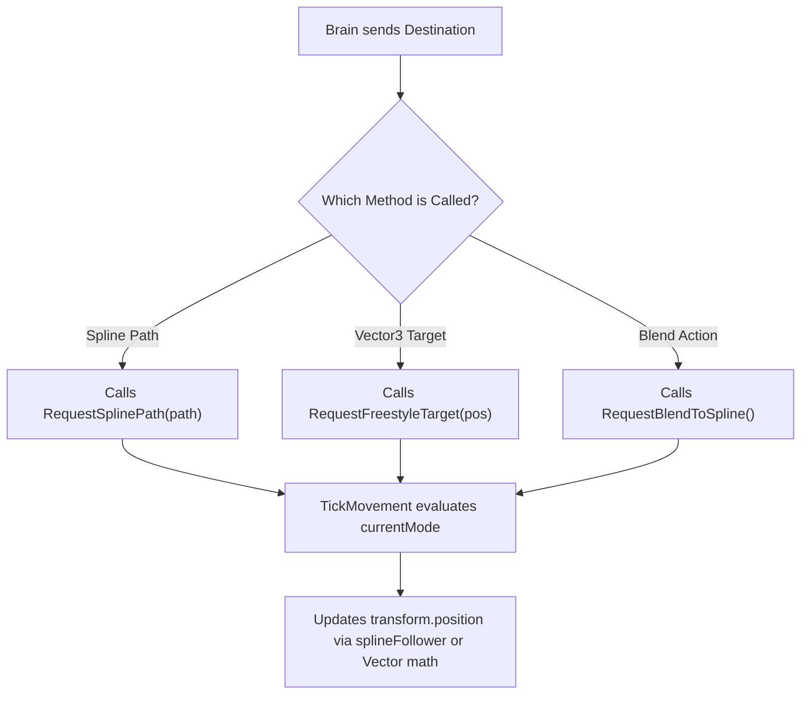
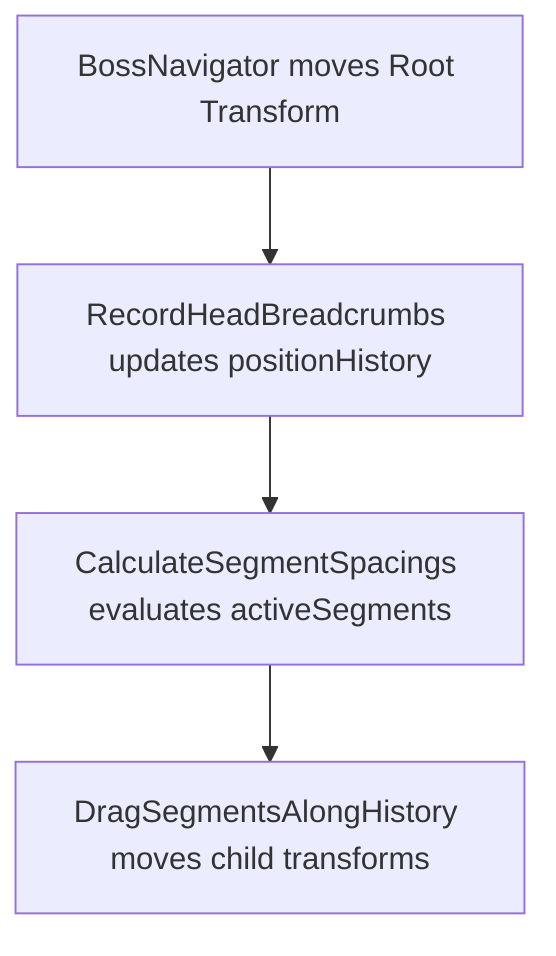

# Dragon Boss Architecture Blueprint

Defines Greenfield implementation for Quest Machine integration. Target: Decouple AI from movement.

---

## 0. Combat Dynamics (The Game Loop)

Player Objective: Destroy Power Crystals. Pick off minions. Force Dragon into unrecoverable state. Survive.
Dragon Objective: Protect Power Crystals. Maintain minion pack count. Corral player using Dark Spirit Clouds. Pivot entirely to defense when player threatens crystals. Kill player.

---

## 1. Required Plugins
This architecture strictly couples with two third-party assets:
- **PixelCrushers Quest Machine:** Replaces all C# AI logic with a visual node editor.
- **Dreamteck Splines:** Provides the `SplineComputer` tracks and `SplineFollower` motors used by the `BossNavigator`.

---

## 2. Target Architecture

Builds four core scripts.

### Pillar A: `QuestMachineDragonBrain`
**Player View:** Dragon proactively controls battlefield. Corrals player using Dark Spirit Clouds. Obscures minions. Pivots entire body and breath to defend threatened Power Crystals. Executes dynamic Last Stand. Uses evasion splines offensively to weave behind cover when starved.
**Code Function:** Reads Quest Machine decisions (such as outputting an 'Evade' action). Triggers game scripts (by calling methods like `BossNavigator.RequestSplinePath()`). Hears signals (such as catching the `OnHealthThresholdReached` C# event from `BossStatsAndHealth`). Updates Quest Machine Node Graph variables. Evaluates state variables via Quest Machine Node Graph (thinks about what to do next). Outputs action. Calls `BossNavigator` methods.
**Why:** Centralizes AI logic in visual node editor. Prevents hardcoded C# logic traps. Enables complex, dynamic combat behaviors.


```text
+-----------------------------------+
|     QuestMachineDragonBrain       |
|    (Implements IDragonBrain)      |
+-----------------------------------+
| - runtimeQuestInstance: Quest     |
| - motor: BossNavigator            |
| - vitals: BossStatsAndHealth      |
+-----------------------------------+
| + OnDamageTaken(amount): void     |
| + OnStaminaDepleted(): void       |
| + HandleQuestMachineAction(): void|
+-----------------------------------+
```

### Pillar B: `BossStatsAndHealth`
**Player View:** Dragon takes calculated damage from player arrow hits. Loses stamina during prolonged attacks. Loses power when pack minions die. Visually reacts to status effects like fire or ice.
**Code Function:** Stores `currentHealth`, `currentStamina`, and an `isDead` boolean flag (rejects multiple arrow hits on the exact same frame during dissolve). Tracks elemental status states. Tracks minion deaths and deducts total boss power. Fires C# event upon crossing thresholds (e.g., reaching critical health or zero stamina).
**Why:** Creates pure data container. Stops health script from forcing movement. Decouples stats from AI decisions.



```text
+-----------------------------------+
|        BossStatsAndHealth         |
+-----------------------------------+
| + currentHealth: float            |
| + currentStamina: float           |
| + maxHealth: float                |
+-----------------------------------+
| + TakeDamage(amount, type): void  |
| + DrainStamina(amount): void      |
| + event OnHealthThresholdReached  |
| + event OnStaminaDepleted         |
+-----------------------------------+
```

### Pillar C: `BossNavigator`
**Player View:** Dragon flies through scene geometry. Locks onto looping observation splines to recharge. Utilizes evasion splines offensively to weave behind cover. Detaches from splines. Flies freely to specific destinations.
**Code Function:** Manipulates `transform.position` and `transform.rotation` using splines or vector math (moves the dragon smoothly through the air). Accepts raw `SplineComputer` references or literal `Vector3` coordinates as input. Routes Dragon to exact location.
**Why:** Makes movement reusable. Stops flight script from querying BossPhase. Decouples path type from AI intent. Permits AI to use "Evasion" splines offensively during Last Stand. Forces Navigator to blindly obey Quest Machine destinations.



```text
+-----------------------------------+
|           BossNavigator           |
+-----------------------------------+
| - currentMode: MovementMode       |
| - splineFollower: SplineFollower  |
| - targetDestination: Vector3      |
+-----------------------------------+
| + RequestSplinePath(path): void   |
| + RequestFreestyleTarget(pos):void|
| + RequestBlendToSpline(): void    |
| - TickMovement(): void            |
+-----------------------------------+
```

### Pillar D: `DragonSnakeMovementStyle`
**Player View:** Dragon body slithers naturally behind head. Player destroys destructible body piece. Body pieces slide forward seamlessly to close structural gaps.
**Code Function:** Updates `positionHistory` list with Head transform data every frame (handles snake physics). Creates breadcrumb trail. Uses `Rigidbody.MovePosition()` (Kinematic) to interpolate child segments along `positionHistory` (prevents arrows from tunneling through fast-moving colliders) based on cumulative bounding box lengths (drags body pieces exactly along the path the head took).
**Why:** Merges three redundant scripts into one. Eliminates duplicate history lists. Confines body physics to single script.



```text
+-----------------------------------+
|     DragonSnakeMovementStyle      |
+-----------------------------------+
| - positionHistory: List<PosData>  |
| - activeSegments: List<Segment>   |
| - segmentSpacing: float           |
| - isClosingGap: bool              |
+-----------------------------------+
| + InitializeAnatomy(): void       |
| - RecordHeadBreadcrumbs(): void   |
| - DragSegmentsAlongHistory(): void|
| - CalculateSegmentSpacings(): void|
| + HandleSegmentDestroyed(): void  |
+-----------------------------------+
```

---


### Pillar E: Quest Machine Nodes (The Logic Links)
**Player View:** Dragon seamlessly transitions between flight modes and reacts to health/crystal changes.
**Code Function:** Lightweight adapter classes. Bridge PixelCrushers' UI to specific game code. Allow node graph to directly call `BossNavigator` and evaluate `BossStatsAndHealth` without writing manual C# logic.
**Why:** Exposes specific game functions inside visual editor UI.

```text
+-----------------------------------+
|   QuestAction_CommandSplineFlight |
|      (Inherits QuestAction)       |
+-----------------------------------+
| + targetSpline: SplineComputer    |
+-----------------------------------+
| + Execute(): void                 |
|   (Calls RequestSplinePath)       |
+-----------------------------------+
```

```text
+-----------------------------------+
| QuestAction_CommandFreestyleFlight|
|      (Inherits QuestAction)       |
+-----------------------------------+
| + targetPosition: Vector3         |
+-----------------------------------+
| + Execute(): void                 |
|   (Calls RequestFreestyleTarget)  |
+-----------------------------------+
```

```text
+-----------------------------------+
| QuestCondition_CheckHealthDrops   |
|     (Inherits QuestCondition)     |
+-----------------------------------+
| + targetThreshold: float          |
+-----------------------------------+
| + IsTrue(): bool                  |
|   (Reads BossStatsAndHealth)      |
+-----------------------------------+
```

```text
+-----------------------------------+
| DragonBrainQuestGenerator_V2      |
|    (Editor/Automation Script)     |
+-----------------------------------+
| - questAsset: Quest               |
| - rootNode: QuestNode             |
+-----------------------------------+
| + GenerateQuestTree(): void       |
| - ConnectNodes(nodeA, nodeB): void|
| - ApplyActionsToNode(node): void  |
+-----------------------------------+
```

---

## 2. Prefab Hierarchy & Dependencies

Target component structure for `Boss_AsianFireDragonNew`. Shows exact script placement.

```text
▼ Boss_AsianFireDragonNew (Root GameObject)
  |-- SplineFollower (Required by BossNavigator. Must set `follow = false` to prevent plugin hijacking).
  |-- BossNavigator.cs (Handles Movement)
  |-- BossStatsAndHealth.cs (Stores Vitals)
  |-- QuestMachineDragonBrain.cs (Runs AI)
  |-- DragonSnakeMovementStyle.cs (Trails Body)
  |-- CreatureStatusEffects.cs (Modifies Speed)
  |
  ▼ Body_Container (Empty parent for organization)
    |-- Dragon_Head (Spawned dynamically, PermanentDragonSegment.cs)
    |-- Dragon_FrontLegs (Spawned dynamically, PermanentDragonSegment.cs)
    |-- Dragon_Body (Spawned dynamically, DragonSegment.cs)
    |-- Dragon_Body (Spawned dynamically, DragonSegment.cs)
    |-- Dragon_Body (Spawned dynamically, DragonSegment.cs)
    |-- Dragon_BackLegs (Spawned dynamically, PermanentDragonSegment.cs)
    |-- Dragon_Tail (Spawned dynamically, PermanentDragonSegment.cs)
```
**Anatomy Note:** `PermanentDragonSegment.cs` attaches to Head, Legs, and Tail. Prevents gory destruction mid-fight. `DragonSegment.cs` attaches to middle body pieces. Permits mid-fight destruction. `DragonSnakeMovementStyle.cs` tracks all parts identically in its history array.

---
