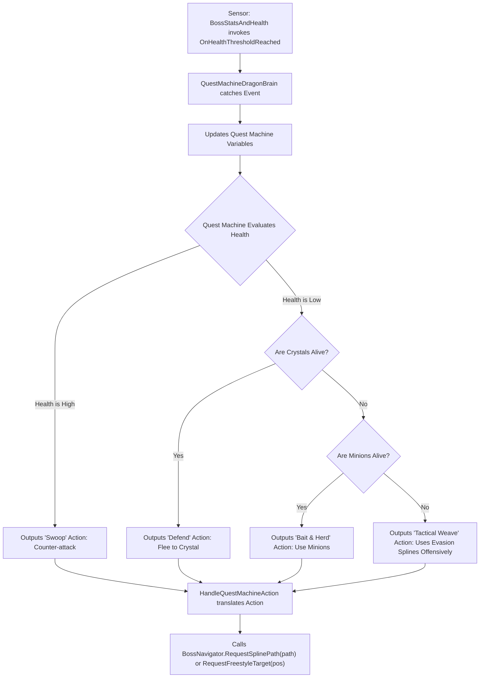
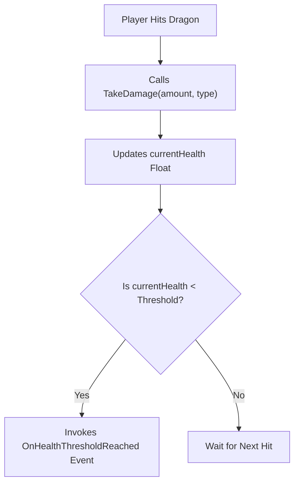
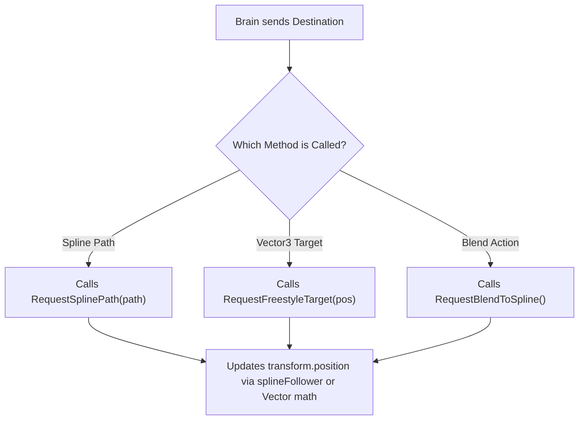
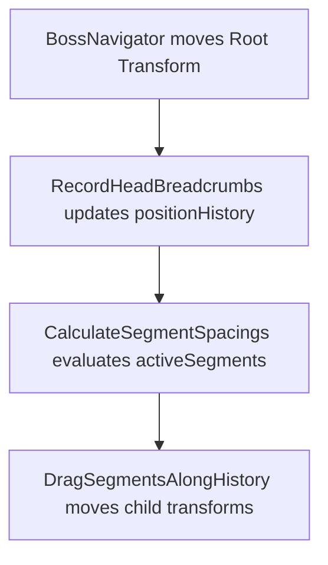

# Dragon Boss Architecture Blueprint

This document defines the greenfield implementation strategy for the Dragon Boss. The overarching goal is to completely decouple the AI logic from the physical movement scripts using the Quest Machine asset.

---

## 1. Combat Dynamics (The Game Loop)

The architecture is driven by the following opposing objectives:
*   **Player Objective:** Destroy the Power Crystals. Pick off the minion pack. Force the Dragon into an unrecoverable state where it cannot heal. Survive the encounters.
*   **Dragon Objective:** Protect the Power Crystals at all costs. Maintain a high minion pack count. Corral the player using area-of-effect hazards (like Dark Spirit Clouds). If the player threatens a crystal, the Dragon must pivot entirely to defense. Kill the player.

---

## 2. Required Plugins & Namespaces

This architecture relies strictly on two third-party Unity assets. Ensure their namespaces are included in your new scripts:
1.  **PixelCrushers Quest Machine:** Replaces all C# AI logic with a visual node editor (`using PixelCrushers.QuestMachine;`).
2.  **Dreamteck Splines:** Provides the `SplineComputer` tracks and `SplineFollower` motors used for movement (`using Dreamteck.Splines;`).

---

## 3. The Four Core Pillars (Target Architecture)

The system must be built using four isolated scripts.

### Pillar A: `QuestMachineDragonBrain`
*   **Player View:** The Dragon proactively controls the battlefield. It corrals the player using Dark Spirit Clouds to obscure its minions. It pivots its entire body and breath weapons to defend threatened Power Crystals. When its health drops to critical thresholds, it executes a dynamic Last Stand, utilizing evasion splines offensively to weave behind cover.
*   **Code Function:** This script acts as an adapter. It reads Quest Machine decisions (such as outputting an 'Evade' action) and triggers the corresponding game scripts (by calling methods like `BossNavigator.RequestSplinePath()`). It listens for signals (such as catching the `OnHealthThresholdReached` C# event from `BossStatsAndHealth`) and updates the Quest Machine Node Graph variables accordingly.
*   **Architectural Benefit:** Centralizing all AI logic in the visual node editor prevents hardcoded C# logic traps and enables complex, dynamic combat behaviors that are easy to balance visually.



```text
+-----------------------------------+
|     QuestMachineDragonBrain       |
|    (Implements IDragonBrain)      |
+-----------------------------------+
| - runtimeQuestInstance: Quest     |
| - motor: BossNavigator            |
| - vitals: BossStatsAndHealth      |
+-----------------------------------+
| + OnDamageTaken(amount): void     |
| + OnStaminaDepleted(): void       |
| + HandleQuestMachineAction(): void|
+-----------------------------------+
```

### Pillar B: `BossStatsAndHealth`
*   **Player View:** The Dragon takes calculated damage from player arrow hits. It loses stamina during prolonged attacks. It loses overall power when its pack minions die. It applies visual shader effects when reacting to elemental status hits (e.g., burning, frozen).
*   **Code Function:** This script acts as a pure data container. It stores the `currentHealth` and `currentStamina` float variables. It manages an `isDead` boolean flag (which rejects multiple arrow hits occurring on the exact same frame during a dissolve sequence) and tracks elemental status states. It fires C# events when specific thresholds are crossed.
*   **Architectural Benefit:** Creating a pure data container stops the health script from directly forcing the Dragon to move, successfully decoupling stat tracking from AI decisions.



```text
+-----------------------------------+
|        BossStatsAndHealth         |
+-----------------------------------+
| + currentHealth: float            |
| + currentStamina: float           |
| + maxHealth: float                |
| + criticalHealthThreshold: float  |
+-----------------------------------+
| + TakeDamage(amount, type): void  |
| + DrainStamina(amount): void      |
| + event OnHealthThresholdReached  |
| + event OnStaminaDepleted         |
+-----------------------------------+
```

### Pillar C: `BossNavigator`
*   **Player View:** The Dragon flies smoothly through the scene geometry. It locks onto looping observation splines to recharge, detaches seamlessly from splines, and flies freely to specific destinations.
*   **Code Function:** This script controls the spatial location of the root object. It manipulates `transform.position` and `transform.rotation` using splines or vector math. It accepts raw Unity `SplineComputer` references or literal `Vector3` coordinates as inputs to route the Dragon to an exact location.
*   **Architectural Benefit:** This makes movement completely modular. The Navigator script no longer queries AI phases (like `BossPhase.Evading`). Instead, it blindly obeys Quest Machine destinations. Furthermore, it resolves paths dynamically by querying the `BossPathManager`. This means the `BossNavigator` script can be attached to ANY flying creature without breaking.



```text
+-----------------------------------+
|           BossNavigator           |
+-----------------------------------+
| - currentMode: MovementMode       |
| - splineFollower: SplineFollower  |
| - targetDestination: Vector3      |
+-----------------------------------+
| + RequestSplinePath(path): void   |
| + RequestFreestyleTarget(pos):void|
| + RequestBlendToSpline(): void    |
| - TickMovement(): void            |
+-----------------------------------+
```

### Pillar D: `DragonSnakeMovementStyle`
*   **Player View:** The Dragon's body slithers naturally behind the head. If the player destroys a destructible body piece, the remaining body pieces slide forward seamlessly to close the structural gaps.
*   **Code Function:** This script exclusively handles the snake physics. It updates a `positionHistory` list with the Head's transform data every frame to create a breadcrumb trail. It then uses `Rigidbody.MovePosition()` (set to Kinematic) to interpolate the child segment transforms along that `positionHistory` trail based on their cumulative bounding box lengths.
*   **Architectural Benefit:** This script confines all body physics to a single file, eliminating duplicate history lists across the codebase. Because the physics are totally isolated, you can create a completely different monster simply by swapping out this one script, leaving the AI and Navigator entirely untouched.



```text
+-----------------------------------+
|     DragonSnakeMovementStyle      |
+-----------------------------------+
| - positionHistory: List<PosData>  |
| - activeSegments: List<Segment>   |
| - segmentSpacing: float           |
| - isClosingGap: bool              |
+-----------------------------------+
| + InitializeAnatomy(): void       |
| - RecordHeadBreadcrumbs(): void   |
| - DragSegmentsAlongHistory(): void|
| - CalculateSegmentSpacings(): void|
| + HandleSegmentDestroyed(): void  |
+-----------------------------------+
```

---

## 4. Pillar E: Quest Machine Nodes (The Logic Links)

To connect the visual Quest Machine UI to our custom C# scripts, you must build lightweight adapter classes.

*   **Code Function:** These classes bridge PixelCrushers' UI to our specific game code. They allow the node graph to directly call `BossNavigator` and evaluate `BossStatsAndHealth` without writing manual C# logic.
*   **Architectural Benefit:** Quest Machine cannot natively talk to custom scripts out-of-the-box. These adapters expose our specific game functions inside the visual editor UI.

```text
+-----------------------------------+
|   QuestAction_CommandSplineFlight |
|      (Inherits QuestAction)       |
+-----------------------------------+
| + targetSpline: SplineComputer    |
+-----------------------------------+
| + Execute(): void                 |
|   (Calls RequestSplinePath)       |
+-----------------------------------+
```

```text
+-----------------------------------+
| QuestAction_CommandFreestyleFlight|
|      (Inherits QuestAction)       |
+-----------------------------------+
| + targetPosition: Vector3         |
+-----------------------------------+
| + Execute(): void                 |
|   (Calls RequestFreestyleTarget)  |
+-----------------------------------+
```

```text
+-----------------------------------+
| QuestCondition_CheckHealthDrops   |
|     (Inherits QuestCondition)     |
+-----------------------------------+
| + targetThreshold: float          |
+-----------------------------------+
| + IsTrue(): bool                  |
|   (Reads BossStatsAndHealth)      |
+-----------------------------------+
```

```text
+-----------------------------------+
| DragonBrainQuestGenerator_V2      |
|    (Editor/Automation Script)     |
+-----------------------------------+
| - questAsset: Quest               |
| - rootNode: QuestNode             |
+-----------------------------------+
| + GenerateQuestTree(): void       |
| - ConnectNodes(nodeA, nodeB): void|
| - ApplyActionsToNode(node): void  |
+-----------------------------------+
```

---

## 5. Prefab Hierarchy & Dependencies

This is the exact target component structure for the `Boss_AsianFireDragonNew` prefab. Ensure all scripts are placed correctly.

```text
▼ Boss_AsianFireDragonNew (Root GameObject)
  |-- SplineFollower (Required by BossNavigator. Must set `follow = false` to prevent plugin hijacking).
  |-- BossNavigator.cs (Handles Movement)
  |-- BossStatsAndHealth.cs (Stores Vitals)
  |-- QuestMachineDragonBrain.cs (Runs AI)
  |-- DragonSnakeMovementStyle.cs (Trails Body)
  |-- CreatureStatusEffects.cs (Modifies Speed)
  |
  ▼ Body_Container (Empty parent for organization)
    |-- Dragon_Head (Spawned dynamically, PermanentDragonSegment.cs)
    |-- Dragon_FrontLegs (Spawned dynamically, PermanentDragonSegment.cs)
    |-- Dragon_Body (Spawned dynamically, DragonSegment.cs)
    |-- Dragon_Body (Spawned dynamically, DragonSegment.cs)
    |-- Dragon_Body (Spawned dynamically, DragonSegment.cs)
    |-- Dragon_BackLegs (Spawned dynamically, PermanentDragonSegment.cs)
    |-- Dragon_Tail (Spawned dynamically, PermanentDragonSegment.cs)
```

**Anatomy Note:**
The `PermanentDragonSegment.cs` script attaches to the Head, Legs, and Tail to prevent gory destruction mid-fight. The `DragonSegment.cs` script attaches only to the middle body pieces, permitting them to be destroyed by the player. The `DragonSnakeMovementStyle.cs` script tracks both types of segments identically in its history array.

---

## 6. Implementation Checklist (Order of Operations)

Follow this modular sequence to implement the greenfield architecture.

### Core Directives
1.  **Exclude C# AI Logic:** Ensure that C# scripts contain no combat decision logic (e.g., checking `if (health < threshold)` to trigger an attack). All combat logic must be evaluated natively inside the Quest Machine node editor.
2.  **Ensure Proper Component References:** Custom Quest Actions must locate the correct Boss instance by calling `GetComponent<BossNavigator>()` on the `Quest` asset's assigned owner object.

### Phase 1: Isolate Data (Vitals)
- [ ] Create a new script `BossStatsAndHealth.cs`.
- [ ] Define a serialized float `public float criticalHealthThreshold = 50f;` so designers can balance it in the Inspector.
- [ ] Ensure `TakeDamage()` checks a private `isDead` flag first (to prevent double-kills from rapid arrow hits).
- [ ] Ensure `TakeDamage()` updates the health float and strictly fires an `OnHealthThresholdReached` C# event when `currentHealth` drops below `criticalHealthThreshold`.

### Phase 2: Isolate Movement (Navigator)
- [ ] Create a new script `BossNavigator.cs` inheriting directly from `MonoBehaviour`.
- [ ] Expose `RequestSplinePath(SplineComputer path)`, `RequestFreestyleTarget(Vector3 pos)`, and `RequestBlendToSpline()` as public methods.
- [ ] Ensure `TickMovement()` multiplies the baseline flight speed by `CreatureStatusEffects.CurrentSpeedMultiplier`.

### Phase 3: Consolidate Physics (Snake Body)
- [ ] Create a new script `DragonSnakeMovementStyle.cs`.
- [ ] Declare a single `positionHistory` array to track the head's breadcrumbs.
- [ ] Write the math to calculate segment spacing based on bounding box lengths.
- [ ] Write the math to interpolate child segments along the history array. **Crucial constraint:** Use `Rigidbody.MovePosition()` and `Rigidbody.MoveRotation()` (do NOT use `transform.position`) to prevent fast-moving arrows from tunneling through the colliders.

### Phase 4: Implement AI (Quest Machine)
- [ ] Modify the existing `HealthCrystal.cs` script so it fires events directly to `QuestMachineDragonBrain.OnCrystalDamaged(HealthCrystal crystal)`. (Ensure you pass the specific crystal reference).
- [ ] Create a new script `QuestMachineDragonBrain.cs` that implements `IDragonBrain`.
- [ ] Create the custom Quest Machine adapter nodes defined in Pillar E: `QuestAction_CommandSplineFlight`, `QuestAction_CommandFreestyleFlight`, and `QuestCondition_CheckHealthDrops`.
- [ ] Write a new Editor automation script (`DragonBrainQuestGenerator_V2.cs`) to build the logic tree using these custom nodes.
- [ ] Configure the generated logic tree to handle the following fallback scenarios using Quest Machine variables (e.g., `ActiveCrystals == 0`):
  - *Condition: High Health* -> Action: Output 'Swoop' (Counter-attack).
  - *Condition: Low Health + ActiveCrystals > 0* -> Action: Output 'Defend' (Flee to Crystal).
  - *Condition: Low Health + ActiveCrystals == 0 + MinionsAlive > 0* -> Action: Output 'Bait & Herd' (Use Minions).
  - *Condition: Low Health + ActiveCrystals == 0 + MinionsAlive == 0* -> Action: Output 'Tactical Weave' (Last Stand using Evasion Splines offensively).