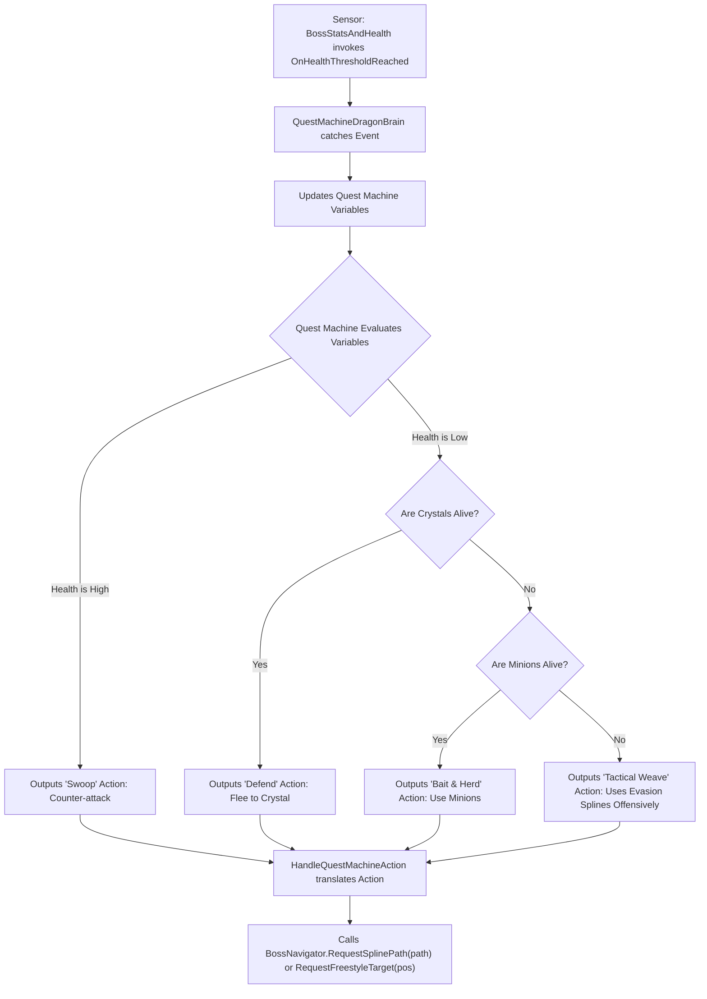
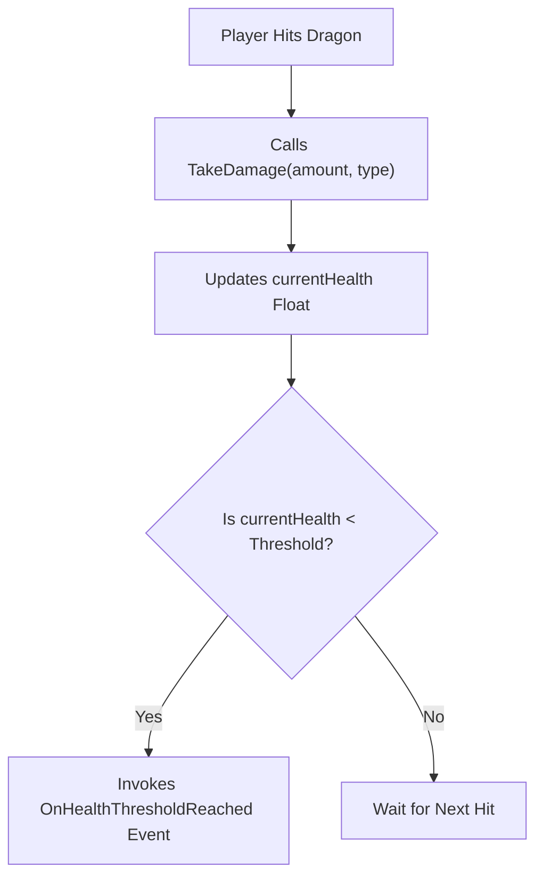
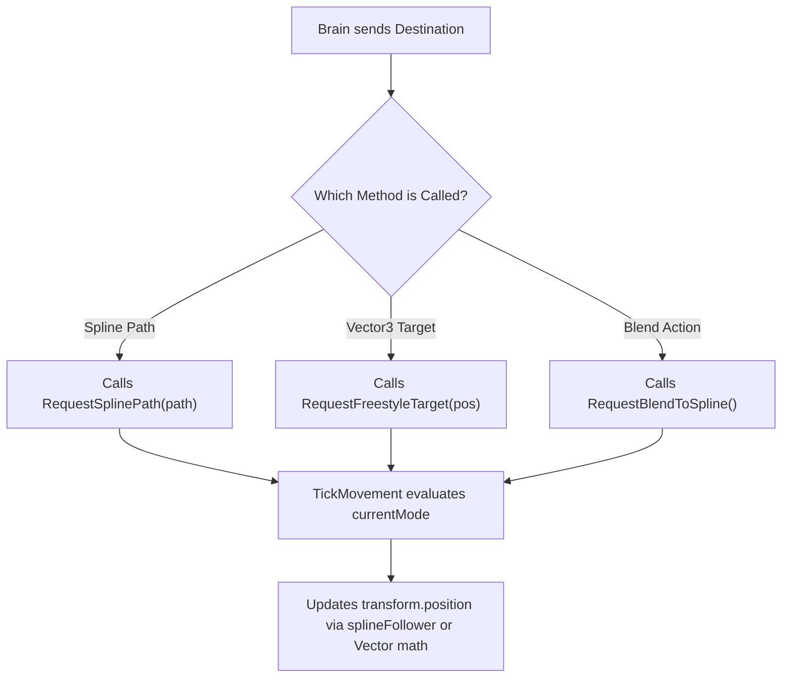
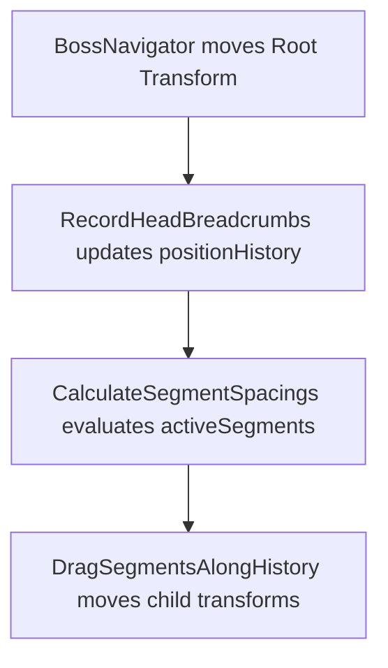

# Dragon Boss Refactor Plan

Maps Quest Machine integration. Target: Decouple AI from movement.

---

## 0. Combat Dynamics (The Game Loop)

Player Objective: Destroy Power Crystals. Pick off minions. Force Dragon into unrecoverable state. Survive.
Dragon Objective: Protect Power Crystals. Maintain minion pack count. Corral player using Dark Spirit Clouds. Pivot entirely to defense when player threatens crystals. Kill player.

---

## 1. Target Architecture

Builds four core scripts.

### Pillar A: `QuestMachineDragonBrain`
**Player View:** Dragon proactively controls battlefield. Corrals player using Dark Spirit Clouds. Obscures minions. Pivots entire body and breath to defend threatened Power Crystals. Executes dynamic Last Stand. Uses evasion splines offensively to weave behind cover when starved.
**Code Function:** Translates Quest Machine actions into C# commands. Listens for C# events from `BossStatsAndHealth` and environment sensors. Updates Quest Machine Node Graph variables. Evaluates state variables via Quest Machine Node Graph. Outputs action. Calls `BossNavigator` methods.
**Why:** Centralizes AI logic in visual node editor. Prevents hardcoded C# logic traps. Enables complex, dynamic combat behaviors.



```text
+-----------------------------------+
|     QuestMachineDragonBrain       |
|    (Implements IDragonBrain)      |
+-----------------------------------+
| - runtimeQuestInstance: Quest     |
| - motor: BossNavigator            |
| - vitals: BossStatsAndHealth      |
+-----------------------------------+
| + OnDamageTaken(amount): void     |
| + OnStaminaDepleted(): void       |
| + HandleQuestMachineAction(): void|
+-----------------------------------+
```

### Pillar B: `BossStatsAndHealth`
**Player View:** Dragon takes calculated damage from player arrow hits. Loses stamina during prolonged attacks. Loses power when pack minions die. Visually reacts to status effects like fire or ice.
**Code Function:** Stores `currentHealth` and `currentStamina` float variables. Tracks elemental status states. Tracks minion deaths and deducts total boss power. Fires C# event upon crossing thresholds (e.g., reaching critical health or zero stamina).
**Why:** Creates pure data container. Stops health script from forcing movement. Decouples stats from AI decisions.



```text
+-----------------------------------+
|        BossStatsAndHealth         |
+-----------------------------------+
| + currentHealth: float            |
| + currentStamina: float           |
| + maxHealth: float                |
+-----------------------------------+
| + TakeDamage(amount, type): void  |
| + DrainStamina(amount): void      |
| + event OnHealthThresholdReached  |
| + event OnStaminaDepleted         |
+-----------------------------------+
```
**Refactor Action:** Delete `BossCreature.cs` `Update()` loop. Delete AI logic. Rename file to `BossStatsAndHealth.cs`. Add elemental state tracking properties.

### Pillar C: `BossNavigator`
**Player View:** Dragon flies through scene geometry. Locks onto looping observation splines to recharge. Utilizes evasion splines offensively to weave behind cover. Detaches from splines. Flies freely to specific destinations.
**Code Function:** Manipulates `transform.position` and `transform.rotation` using splines or vector math. Accepts Unity `SplineComputer` paths or literal `Vector3` coordinates as input. Routes Dragon to exact location.
**Why:** Makes movement reusable. Stops flight script from querying BossPhase. Decouples path type from AI intent. Permits AI to use "Evasion" splines offensively during Last Stand. Forces Navigator to blindly obey Quest Machine destinations.



```text
+-----------------------------------+
|           BossNavigator           |
+-----------------------------------+
| - currentMode: MovementMode       |
| - splineFollower: SplineFollower  |
| - targetDestination: Vector3      |
+-----------------------------------+
| + RequestSplinePath(path): void   |
| + RequestFreestyleTarget(pos):void|
| + RequestBlendToSpline(): void    |
| - TickMovement(): void            |
+-----------------------------------+
```
**Refactor Action:** Rewrite `AirborneBossMovement.cs`. Rename file to `BossNavigator.cs`. Delete `BossPhase` references.

### Pillar D: `DragonSnakeMovementStyle`
**Player View:** Dragon body slithers naturally behind head. Player destroys destructible body piece. Body pieces slide forward seamlessly to close structural gaps.
**Code Function:** Updates `positionHistory` list with Head transform data every frame. Creates breadcrumb trail. Interpolates child segment transforms along `positionHistory` based on cumulative bounding box lengths.
**Why:** Merges three redundant scripts into one. Eliminates duplicate history lists. Confines body physics to single script.



```text
+-----------------------------------+
|     DragonSnakeMovementStyle      |
+-----------------------------------+
| - positionHistory: List<PosData>  |
| - activeSegments: List<Segment>   |
| - segmentSpacing: float           |
| - isClosingGap: bool              |
+-----------------------------------+
| + InitializeAnatomy(): void       |
| - RecordHeadBreadcrumbs(): void   |
| - DragSegmentsAlongHistory(): void|
| - CalculateSegmentSpacings(): void|
| + HandleSegmentDestroyed(): void  |
+-----------------------------------+
```
**Refactor Action:** Delete `DragonMovementManager.cs`. Delete `DragonSpacingManager.cs`. Merge `UpdateBreadcrumbs()` and `GetTargetDistanceForSegment()` methods into `SegmentedDragonManager.cs`. Rename `SegmentedDragonManager.cs` to `DragonSnakeMovementStyle.cs`.

---

## 2. Current Flaws & Fixes

Addresses redundant legacy logic.

### Flaw 1: `BossCreature.cs`
**Problem:** Holds health data and AI logic. `EvaluateThreat()` method checks `currentHealth`. Method calls `movementManager.ForceImmediateEvasion()`. Logic bypasses Quest Machine completely.
**Fix:** Delete `EvaluateDesires()`. Delete `ForceImmediateEvasion()`. Move evasion logic into Quest Machine Node Graph. Move health data into `BossStatsAndHealth.cs`.
**Why:** Guarantees Quest Machine acts as sole brain. Prevents hidden C# overrides from breaking boss fight sequence.

### Flaw 2: `AirborneBossMovement.cs`
**Problem:** Controls flight and AI logic. Checks `BossCreature.currentPhase`. Checks `isTethered`.
**Fix:** Rename file to `BossNavigator.cs`. Delete phase checks. Move tether math into `DragonSnakeMovementStyle.cs`.
**Why:** Enforces single responsibility. Navigator flies exclusively. Physics script handles structural tethers.

### Flaw 3: Physics Scripts
**Problem:** Three separate scripts drag body parts.
- `SegmentedDragonManager.cs` maintains `positionHistory` list.
- `DragonMovementManager.cs` maintains duplicate `positionHistory` list.
- `DragonSpacingManager.cs` calculates distances.
**Fix:** Delete `DragonMovementManager.cs`. Delete `DragonSpacingManager.cs`. Move math into `DragonSnakeMovementStyle.cs`.
**Why:** Removes memory waste. Stops three scripts from computing identical body segment coordinates simultaneously.

### Flaw 4: Status Scripts
- **`CreatureStatusEffects.cs`:** Manages speed multipliers. Keep script. `BossNavigator.cs` reads script to adjust flight speed.
```text
+-----------------------------------+
|       CreatureStatusEffects       |
+-----------------------------------+
| + CurrentSpeedMultiplier: float   |
| + IsBrittle: bool                 |
+-----------------------------------+
| + ApplyElementalEffect(): void    |
| - TemporarySpeedModifier(): Enum  |
+-----------------------------------+
```

- **`DesireEvaluator.cs`:** Runs math. Delete script. Move math into Quest Machine Node Conditions.
**Why:** Moves math into visual editor. Eases combat balancing.
```text
+-----------------------------------+
|          DesireEvaluator          |
+-----------------------------------+
| + survivalWeight: float           |
| + territoryWeight: float          |
+-----------------------------------+
| + Evaluate(brain, tags): Result   |
+-----------------------------------+
```

- **`BossEventBus.cs`:** Fires events. Delete script. Modify `HealthCrystal.cs`. `HealthCrystal.cs` fires event directly to `QuestMachineDragonBrain.cs`.
**Why:** Removes middleman manager. Sensors ping Brain directly.
```text
+-----------------------------------+
|            BossEventBus           |
+-----------------------------------+
| + OnBossDamaged: Action           |
| + OnCrystalDamaged: Action        |
+-----------------------------------+
| + TriggerBossDamaged(): void      |
| + TriggerCrystalDamaged(): void   |
+-----------------------------------+
```

---

## 3. Prefab Hierarchy & Dependencies

Target component structure for `Boss_AsianFireDragonNew`. Shows exact script placement.

```text
▼ Boss_AsianFireDragonNew (Root GameObject)
  |-- SplineFollower (Required by BossNavigator)
  |-- BossNavigator.cs (Handles Movement)
  |-- BossStatsAndHealth.cs (Stores Vitals)
  |-- QuestMachineDragonBrain.cs (Runs AI)
  |-- DragonSnakeMovementStyle.cs (Trails Body)
  |-- CreatureStatusEffects.cs (Modifies Speed)
  |
  ▼ Body_Container (Empty parent for organization)
    |-- Dragon_Head (Spawned dynamically, PermanentDragonSegment.cs)
    |-- Dragon_FrontLegs (Spawned dynamically, PermanentDragonSegment.cs)
    |-- Dragon_Body (Spawned dynamically, DragonSegment.cs)
    |-- Dragon_Body (Spawned dynamically, DragonSegment.cs)
    |-- Dragon_Body (Spawned dynamically, DragonSegment.cs)
    |-- Dragon_BackLegs (Spawned dynamically, PermanentDragonSegment.cs)
    |-- Dragon_Tail (Spawned dynamically, PermanentDragonSegment.cs)
```
**Anatomy Note:** `PermanentDragonSegment.cs` attaches to Head, Legs, and Tail. Prevents gory destruction mid-fight. `DragonSegment.cs` attaches to middle body pieces. Permits mid-fight destruction. `DragonSnakeMovementStyle.cs` tracks all parts identically in its history array.

---

## 4. Refactoring Checklist (Order of Operations)

Follow modular sequence. Test after every phase.

### Phase 1: Isolate Data (Vitals)
- [ ] Rename `BossCreature.cs` to `BossStatsAndHealth.cs`.
- [ ] Delete `Update()` loop inside `BossStatsAndHealth.cs`.
- [ ] Delete `EvaluateThreat()` and `ForceImmediateEvasion()`.
- [ ] Create `OnHealthThresholdReached` C# event.
- **Test:** Shoot Dragon. Verify health float drops. Verify C# event fires. Dragon must not move.

### Phase 2: Isolate Movement (Navigator)
- [ ] Rename `AirborneBossMovement.cs` to `BossNavigator.cs`.
- [ ] Delete all references to `BossPhase` enum.
- [ ] Expose `RequestSplinePath()`, `RequestFreestyleTarget()`, and `RequestBlendToSpline()` as public methods.
- **Test:** Call `RequestFreestyleTarget(pos)` via Inspector/Debug button. Verify Dragon flies to coordinate.

### Phase 3: Consolidate Physics (Snake Body)
- [ ] Rename `SegmentedDragonManager.cs` to `DragonSnakeMovementStyle.cs`.
- [ ] Copy `GetTargetDistanceForSegment()` method from `DragonSpacingManager.cs` directly into `DragonSnakeMovementStyle.cs`.
- [ ] Copy `UpdateBreadcrumbs()` logic from `DragonMovementManager.cs` directly into `DragonSnakeMovementStyle.cs`.
- [ ] Delete `DragonSpacingManager.cs` and `DragonMovementManager.cs`.
- **Test:** Move Root object manually in Scene View. Verify child segments trail perfectly. Verify gaps close when segments are destroyed.

### Phase 4: Implement AI (Quest Machine)
- [ ] Delete `DesireEvaluator.cs` and `BossEventBus.cs`.
- [ ] Modify `HealthCrystal.cs` to invoke `QuestMachineDragonBrain.OnCrystalDamaged()`.
- [ ] Create Quest Machine asset in Unity Editor.
- [ ] Build logic tree for fallback scenarios (High Health -> Attack, Low Health + Crystals -> Flee, Low Health + No Crystals -> Use Minions, Total Starvation -> Tactical Weave).
- **Test 1:** Keep Dragon health high. Attack Dragon. Verify Dragon counter-attacks (Swoops).
- **Test 2:** Drop Dragon health. Keep Crystals alive. Verify Dragon flees to recharge.
- **Test 3:** Drop Dragon health. Destroy all Crystals. Keep Minions alive. Verify Dragon uses minion pack.
- **Test 4:** Drop Dragon health. Destroy all Crystals. Kill all Minions. Verify Dragon executes Last Stand. Verify Dragon actively calls `BossNavigator.RequestSplinePath()` with an Evasion Spline to weave behind cover offensively.
