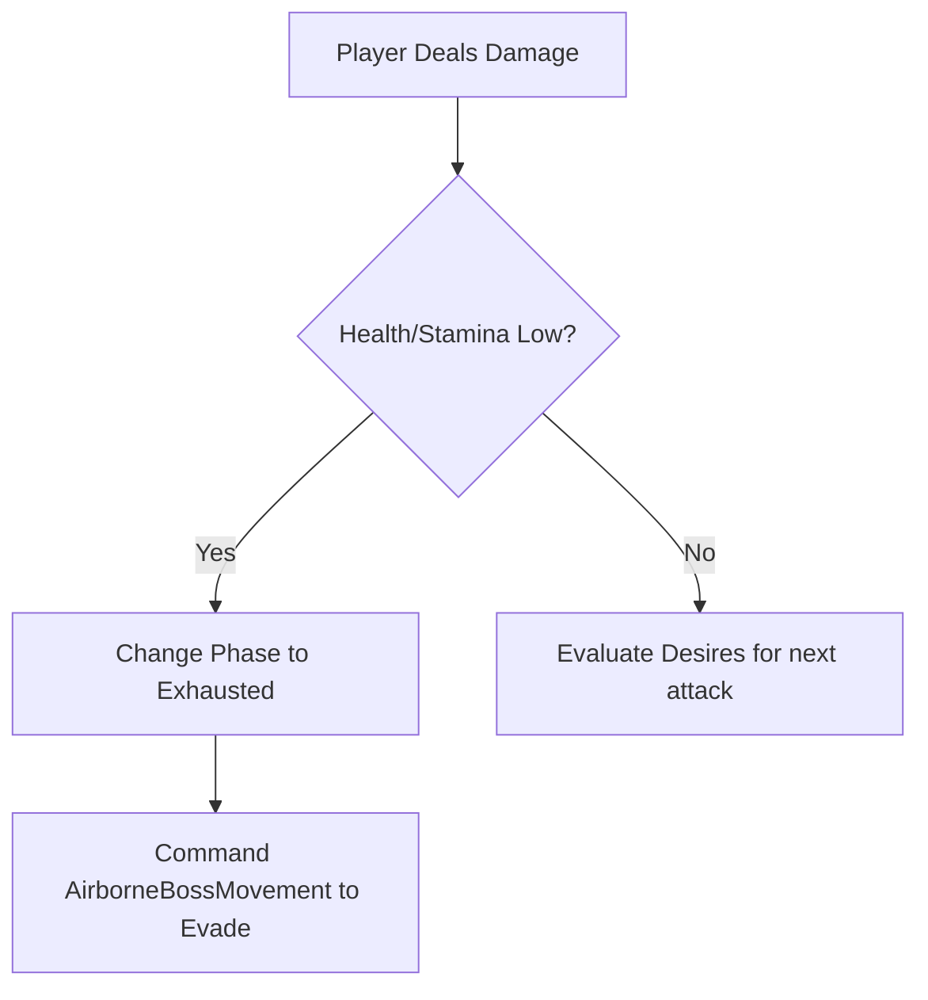
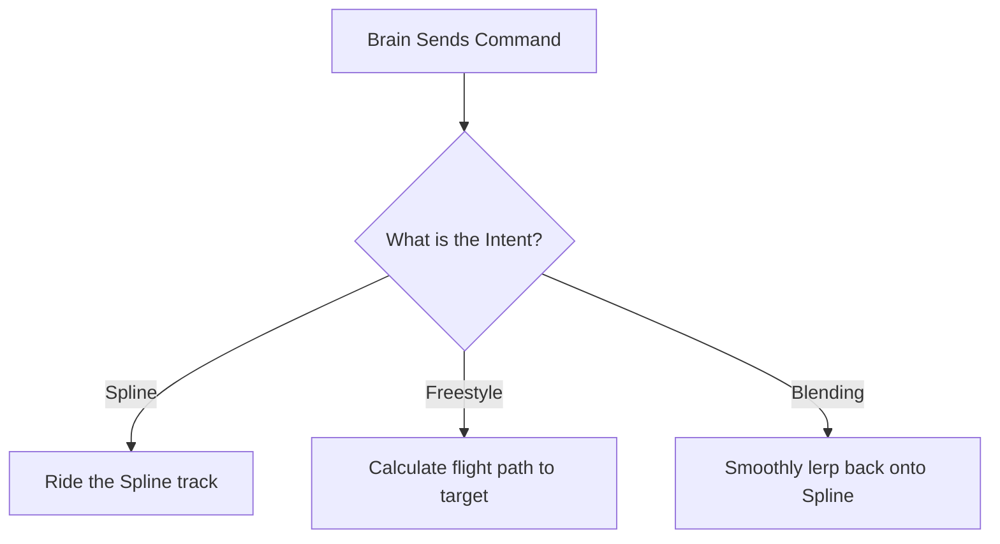
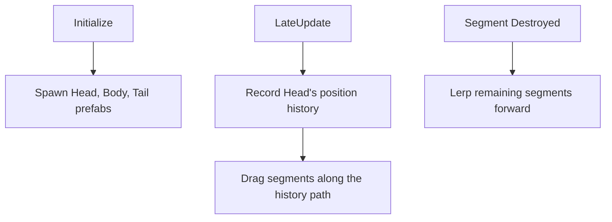
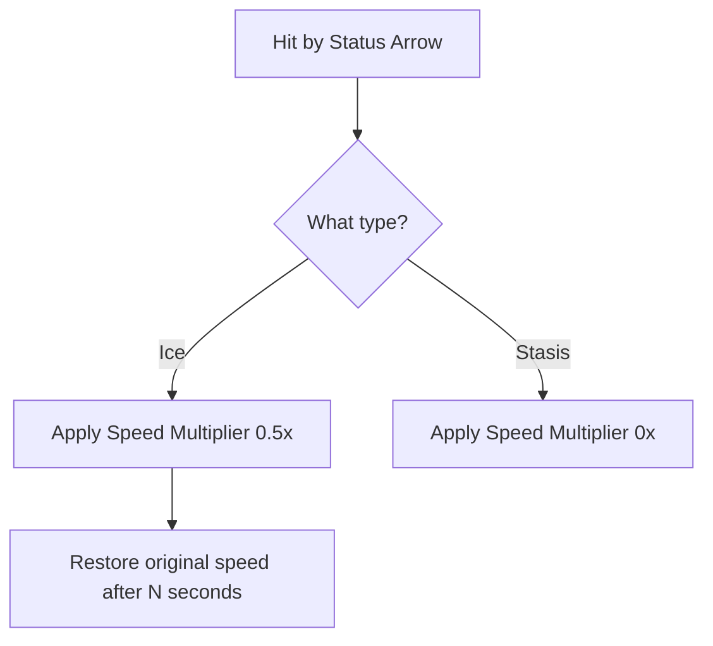

# Dragon Boss Architecture Overview

This document provides a concise overview of the scripts currently driving the Dragon Boss, focusing on the components attached to the root prefab (`Boss_AsianFireDragonNew`). It outlines what each class does, exposes redundancies, and prepares the ground for a cleaner, decoupled refactoring based on the Quest Machine AI paradigm.

---

## 1. Navigators & Brains (The "High-Level" Control)

These scripts decide *what* the dragon wants to do and *where* it should go.

### BossCreature.cs
**Player Perspective:** This is the "Brain" of the Dragon. When the player shoots the dragon or a crystal, this script reacts. It tracks the boss's total health and stamina, and if it gets hurt too much, it forces the dragon to run away or change phases.



```text
+-----------------------------------+
|            BossCreature           |
+-----------------------------------+
| - currentHealth: float            |
| - currentStamina: float           |
| + currentPhase: BossPhase         |
| - eventBus: BossEventBus          |
| - movementManager: AirborneBoss...|
+-----------------------------------+
| + TakeDamage(amount, type): void  |
| + EvaluateDesires(): void         |
| + ForceImmediateEvasion(): void   |
| - EnterExhaustedPhase(): void     |
+-----------------------------------+
```
**Refactoring Notes:** Highly coupled. Mixes state/data tracking (Vitals) with logic/decision-making. Should be split into a pure `BossVitals` data container, letting the Quest Machine Brain handle the logic.

### AirborneBossMovement.cs & BaseBossMovement.cs
**Player Perspective:** This is the "Motor" that physically moves the dragon from point A to point B. It is responsible for making the dragon smoothly fly off a spline, swoop through the air (freestyle), and seamlessly lock back onto an escape spline when fleeing.



```text
+-----------------------------------+
|       AirborneBossMovement        |
|     (inherits BaseBossMovement)   |
+-----------------------------------+
| + currentMode: MovementMode       |
| + glideSpeed: float               |
| - splineFollower: SplineFollower  |
+-----------------------------------+
| + RequestFreestyleIntent(...):void|
| + RequestReturnToCoil(...): void  |
| - UpdateFreestyleMode(): void     |
| - UpdateBlendingMode(): void      |
| # TickMovement(): void            |
+-----------------------------------+
```
**Refactoring Notes:** Good foundation for a pure `BossMotor`. However, it currently queries status effects directly and has some overlapping logic with the Segment Manager regarding how spline-following is handled.

---

## 2. Anatomy & Snake Physics (The "Body")

These scripts handle the serpentine body trailing behind the head. **This area currently has the highest redundancy and overlapping responsibilities.**

### SegmentedDragonManager.cs
**Player Perspective:** When the player looks at the dragon, they see a head followed by a long body and tail. If the player shoots a body segment enough times, it explodes, and the remaining pieces slide forward to close the gap.



```text
+-----------------------------------+
|      SegmentedDragonManager       |
+-----------------------------------+
| + bodyPrefab, headPrefab: GameObj |
| - activeSegments: List<Segment>   |
| - positionHistory: List<PosData>  |
| - isClosingGap: bool              |
| - bossBrain: BossCreature         |
+-----------------------------------+
| + InitializeDragon(): void        |
| - LateUpdate(): void              |
| - UpdateSegmentSpacing(): void    |
| + OnSegmentDestroyed(): void      |
| + TriggerTotalDeath(): void       |
+-----------------------------------+
```
**Refactoring Notes (REDUNDANCY ALERT):** This class is bloated. It spawns the parts, tracks the breadcrumbs, calculates the spacing, handles death sequences, and manages tether clamping. It heavily overlaps with `DragonMovementManager` and `DragonSpacingManager`.

### DragonMovementManager.cs
**Player Perspective:** Similar to SegmentedDragonManager, this is meant to ensure the tail faithfully follows the exact path the head took.

```text
+-----------------------------------+
|       DragonMovementManager       |
+-----------------------------------+
| - positionHistory: List<PosData>  |
| - headTotalDistance: float        |
+-----------------------------------+
| + InitializeMovement(): void      |
| + UpdateBreadcrumbs(): void       |
| + PlaceSegment(): void            |
+-----------------------------------+
```
**Refactoring Notes:** This script appears to be doing *exactly* what `SegmentedDragonManager` is doing internally. They both maintain a `positionHistory` list and drag pieces along it. **These should be merged.**

### DragonSpacingManager.cs
**Player Perspective:** Ensures that when the dragon winds around corners, the body segments don't clip into each other or drift too far apart.

```text
+-----------------------------------+
|       DragonSpacingManager        |
+-----------------------------------+
| + padding: float                  |
| - activeSegmentsData: List        |
+-----------------------------------+
| + RegisterSegment(): void         |
| + GetTargetDistanceForSegment()   |
+-----------------------------------+
```
**Refactoring Notes:** A utility class that calculates bounding box lengths to feed spacing data to `SegmentedDragonManager`. Could easily be folded into the anatomy manager.

### DragonSegment.cs & PermanentDragonSegment.cs
**Player Perspective:** The actual physical targets the player shoots at (the hitboxes).

```text
+-----------------------------------+
|           DragonSegment           |
+-----------------------------------+
| + health: float                   |
| + isDestructiblePart: bool        |
| - isDead: bool                    |
+-----------------------------------+
| + TakeDamage(amount, type): void  |
| # Die(): void                     |
| + TriggerTotalDeath(): void       |
+-----------------------------------+
```

---

## 3. Sensors & Status Effects

### CreatureStatusEffects.cs
**Player Perspective:** When the player shoots an Ice arrow, the dragon visually freezes or slows down drastically in the air.



```text
+-----------------------------------+
|       CreatureStatusEffects       |
+-----------------------------------+
| + CurrentSpeedMultiplier: float   |
| + IsBrittle: bool                 |
+-----------------------------------+
| + ApplyElementalEffect(): void    |
| - TemporarySpeedModifier(): Enum  |
+-----------------------------------+
```

### DesireEvaluator.cs
**Player Perspective:** Behind the scenes math that decides if the dragon wants to protect its crystal more than it wants to chase the player.

```text
+-----------------------------------+
|          DesireEvaluator          |
+-----------------------------------+
| + survivalWeight: float           |
| + territoryWeight: float          |
+-----------------------------------+
| + Evaluate(brain, tags): Result   |
+-----------------------------------+
```
**Refactoring Notes:** Pure logic block. Under the new Quest Machine architecture, this math should likely be represented as Node Conditions or fed into variables read by the Quest Machine logic graph.

### BossEventBus.cs
**Player Perspective:** The invisible communication network that tells the Dragon Brain when a distant Power Crystal is under attack by the player.

```text
+-----------------------------------+
|            BossEventBus           |
+-----------------------------------+
| + OnBossDamaged: Action           |
| + OnCrystalDamaged: Action        |
+-----------------------------------+
| + TriggerBossDamaged(): void      |
| + TriggerCrystalDamaged(): void   |
+-----------------------------------+
```
**Refactoring Notes:** In a decoupled architecture, sensors (like the Crystal) fire these events, and the `QuestMachineDragonBrain` (Adapter) listens to them to update variables in the AI graph.

---

## Summary of Redundancies for Refactoring

1. **The Snake Physics Bleed:** `SegmentedDragonManager`, `DragonMovementManager`, and `DragonSpacingManager` are all attempting to do the same thing: drag body parts behind a head. `DragonMovementManager` seems entirely redundant if `SegmentedDragonManager` is also recording breadcrumbs. **Goal:** Merge into a single, clean `DragonAnatomyPhysics` script that ONLY handles breadcrumbs and lerping.
2. **The Brain Bleed:** `BossCreature` acts as both the health pool (`BossVitals`) and the decision maker (forcing evasion on low health). **Goal:** Strip logic out of `BossCreature`, leaving it purely as `BossVitals` that fires events (like `OnStaminaDepleted`), letting Quest Machine handle the decision to evade.
3. **The Motor:** `AirborneBossMovement` correctly handles the spline-to-freestyle blending, making it a perfect candidate for the `BossMotor`. It just needs to stop querying `BossCreature` phases and only move when explicitly told to by the Quest Machine Adapter.