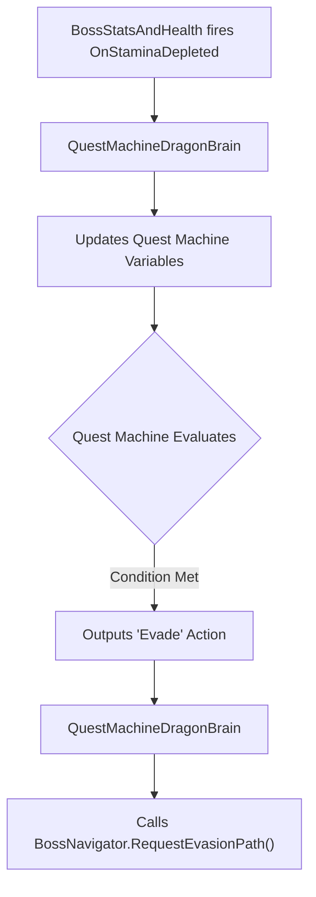
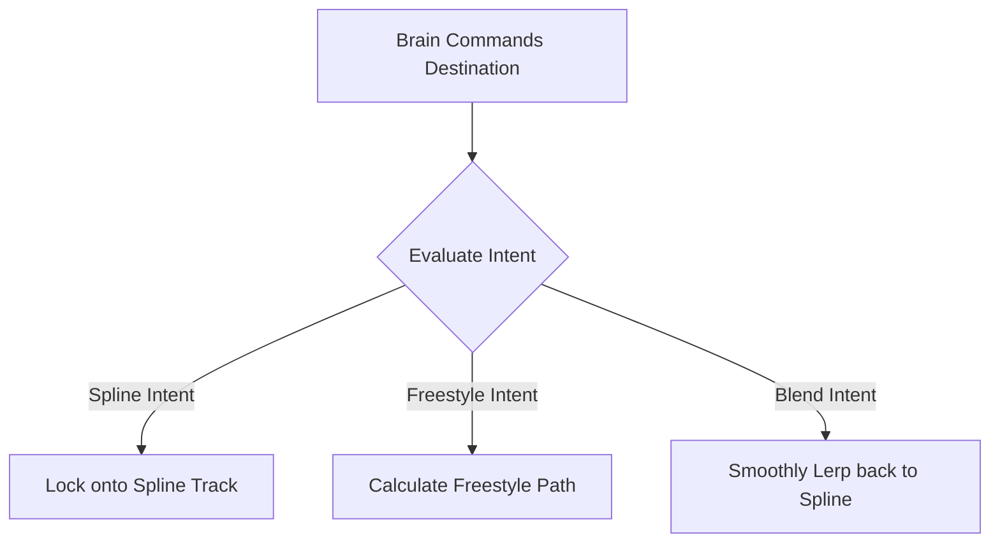

# Dragon Boss Architecture Overview & Refactoring Roadmap

This document provides a concise overview of the scripts currently driving the Dragon Boss and explicitly defines the Target Architecture we are moving toward. It exposes redundancies and maps out exactly how the legacy scripts will be folded into a clean, decoupled, node-driven system based on Quest Machine.

---

## 1. Target Architecture (The "After" Picture)

To achieve absolute separation of concerns, the monolithic scripts will be broken down into four distinct pillars. The AI logic is completely removed from C# and moved into the Quest Machine Node Graph.

### Pillar A: `QuestMachineDragonBrain`
**Player Perspective:** The invisible commander that interprets the game state and translates Quest Machine decisions into physical actions.



```text
+-----------------------------------+
|     QuestMachineDragonBrain       |
|    (Implements IDragonBrain)      |
+-----------------------------------+
| - runtimeQuestInstance: Quest     |
| - motor: BossNavigator            |
| - vitals: BossStatsAndHealth      |
+-----------------------------------+
| + OnDamageTaken(amount): void     |
| + OnStaminaDepleted(): void       |
| + HandleQuestMachineAction(): void|
+-----------------------------------+
```

### Pillar B: `BossStatsAndHealth`
**Player Perspective:** The pure health pool and stamina meter of the dragon.

```text
+-----------------------------------+
|        BossStatsAndHealth         |
+-----------------------------------+
| + currentHealth: float            |
| + currentStamina: float           |
| + maxHealth: float                |
+-----------------------------------+
| + TakeDamage(amount, type): void  |
| + DrainStamina(amount): void      |
| + event OnHealthThresholdReached  |
| + event OnStaminaDepleted         |
+-----------------------------------+
```
*How it removes redundancy:* In the legacy code, `BossCreature` checked `currentHealth` in its `Update()` loop and manually forced evasions. `BossStatsAndHealth` deletes the `Update()` loop entirely. When `currentHealth` drops, it strictly fires the `OnHealthThresholdReached` C# event. It does not know that `BossNavigator` exists.

### Pillar C: `BossNavigator`
**Player Perspective:** The engine that drives the dragon from point A to point B, handling the smooth transitions between riding a spline track and flying freely through the air.



```text
+-----------------------------------+
|           BossNavigator           |
+-----------------------------------+
| - currentMode: MovementMode       |
| - splineFollower: SplineFollower  |
| - targetDestination: Vector3      |
+-----------------------------------+
| + RequestSplinePath(path): void   |
| + RequestFreestyleTarget(pos):void|
| + RequestBlendToSpline(): void    |
| - TickMovement(): void            |
+-----------------------------------+
```
*How it removes redundancy:* In the legacy `AirborneBossMovement`, the `RequestReturnToCoil()` method accepted an observation path, but the script internally checked `BossCreature.currentPhase` to decide how to fly. `BossNavigator` deletes all references to `BossPhase`. It only stores the `targetDestination` Vector3 and moves toward it.

### Pillar D: `DragonSnakeMovementStyle`
**Player Perspective:** The physical trailing of the body. As the head (moved by the Navigator) flies around, this system ensures the body parts follow seamlessly, close gaps when pieces are destroyed, and wave in a snake-like manner.

```text
+-----------------------------------+
|     DragonSnakeMovementStyle      |
+-----------------------------------+
| - positionHistory: List<PosData>  |
| - activeSegments: List<Segment>   |
| - segmentSpacing: float           |
| - isClosingGap: bool              |
+-----------------------------------+
| + InitializeAnatomy(): void       |
| - RecordHeadBreadcrumbs(): void   |
| - DragSegmentsAlongHistory(): void|
| - CalculateSegmentSpacings(): void|
| + HandleSegmentDestroyed(): void  |
+-----------------------------------+
```
*How it removes redundancy:* It absorbs `DragonMovementManager.positionHistory` and `SegmentedDragonManager.positionHistory` into one single list. It absorbs the bounding box logic from `DragonSpacingManager.GetTargetDistanceForSegment()` directly into its `CalculateSegmentSpacings()` method, eliminating the need for three separate scripts trying to calculate the same tail positions.

---

## 2. Current State (The "Before" Picture & Explicit Flaws)

The legacy architecture being replaced.

### The Monolithic Brain (`BossCreature.cs`)
```text
+-----------------------------------+
|            BossCreature           |
+-----------------------------------+
| - currentHealth: float            |
| - currentStamina: float           |
| + currentPhase: BossPhase         |
| - movementManager: AirborneBoss...|
+-----------------------------------+
| + TakeDamage(amount, type): void  |
| + EvaluateDesires(): void         |
| + ForceImmediateEvasion(): void   |
| - EnterExhaustedPhase(): void     |
+-----------------------------------+
```
**The Flaw (Mixed Responsibilities):** `BossCreature` acts as a data container (holding `currentHealth` and `currentStamina`) but also acts as the AI controller. Inside `EvaluateThreat()`, if `currentHealth` drops below `evasionDamageThreshold`, it directly calls `movementManager.ForceImmediateEvasion()`. This hardcoded C# logic completely bypasses the Quest Machine Node Graph.
**The Fix:**
1. Move `currentHealth`, `currentStamina`, and `TakeDamage()` into the new `BossStatsAndHealth.cs` script.
2. Delete `EvaluateDesires()`, `ForceImmediateEvasion()`, and `EnterExhaustedPhase()` from C#. Rebuild this logic visually as a Condition Node inside the Quest Machine UI (e.g., `If Health < Threshold -> Output Evade Action`).

### The Overlapping Motor (`AirborneBossMovement.cs`)
```text
+-----------------------------------+
|       AirborneBossMovement        |
+-----------------------------------+
| + currentMode: MovementMode       |
| - splineFollower: SplineFollower  |
| - statusEffects: CreatureStatus...|
+-----------------------------------+
| + RequestFreestyleIntent(...):void|
| + RequestReturnToCoil(...): void  |
| - UpdateFreestyleMode(): void     |
| - UpdateBlendingMode(): void      |
+-----------------------------------+
```
**The Flaw (Logic Bleed):** In `AirborneBossMovement.TickMovement()`, the script explicitly calls `GetComponent<CreatureStatusEffects>()` to pull the `CurrentSpeedMultiplier` and alters its own speed. It also internally manages an `isTethered` boolean flag and applies rubber-band math.
**The Fix:**
1. Rename class to `BossNavigator.cs`.
2. `BossNavigator` keeps `RequestFreestyleIntent()` and `RequestReturnToCoil()`.
3. `BossNavigator` still reads `CreatureStatusEffects.CurrentSpeedMultiplier`, but it stops making decisions based on tethers. Tether logic is moved to the physics layer.

### The Scattered Snake Physics
**The Flaw (Highest Redundancy):**
- `SegmentedDragonManager.cs`: Maintains a `List<PositionData> positionHistory` in its `LateUpdate()` loop to drag the parts. It handles the `gapCloseTimer` when a part dies.
- `DragonMovementManager.cs`: Also maintains its own identical `List<PositionData> positionHistory` and calculates `distanceTraveled`. It contains a duplicate method `PlaceSegment()`.
- `DragonSpacingManager.cs`: Holds a `List<SegmentData> activeSegmentsData` just to calculate the bounding box sizes and returns float distances via `GetTargetDistanceForSegment()`.
**The Fix:**
1. Delete `DragonMovementManager.cs` entirely.
2. Delete `DragonSpacingManager.cs` entirely.
3. Rename `SegmentedDragonManager.cs` to `DragonSnakeMovementStyle.cs`.
4. Copy the float math from `DragonSpacingManager.GetTargetDistanceForSegment()` and paste it directly into a private method inside `DragonSnakeMovementStyle.cs`.
5. Maintain only one `List<PositionData> positionHistory` inside `DragonSnakeMovementStyle.cs` to handle both normal trailing and gap-closing interpolation.

### Sensors & Status Effects
- **`CreatureStatusEffects.cs`:** Manages Speed Multipliers (Ice, Stasis). Remains as a modular component. `BossNavigator.TickMovement()` will multiply its speed by `CreatureStatusEffects.CurrentSpeedMultiplier`.
- **`DesireEvaluator.cs`:** This script runs math like `survivalWeight * 1.5f` to decide what the boss wants. **The Fix:** Delete this script. Move the weight math into variables (Counters) inside the Quest Machine Editor.
- **`BossEventBus.cs`:** Holds `Action<HealthCrystal> OnCrystalDamaged`. **The Fix:** Delete this script. Modify `HealthCrystal.cs` so that when shot, it fires a C# event directly to the `IDragonBrain` interface via `FindFirstObjectByType<QuestMachineDragonBrain>().OnCrystalDamaged()`.