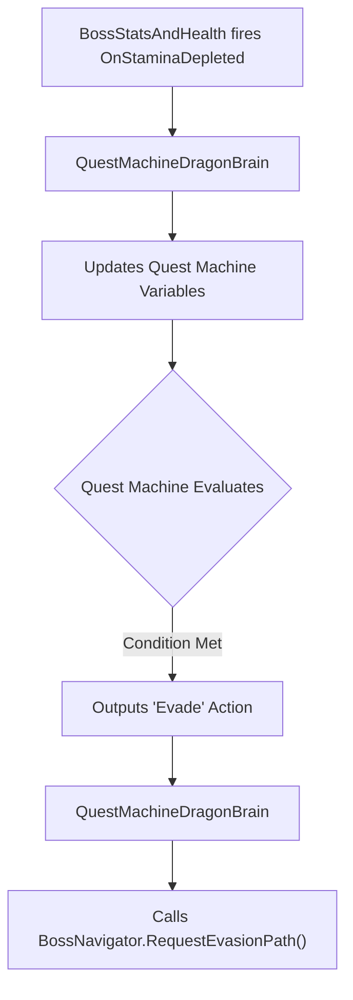
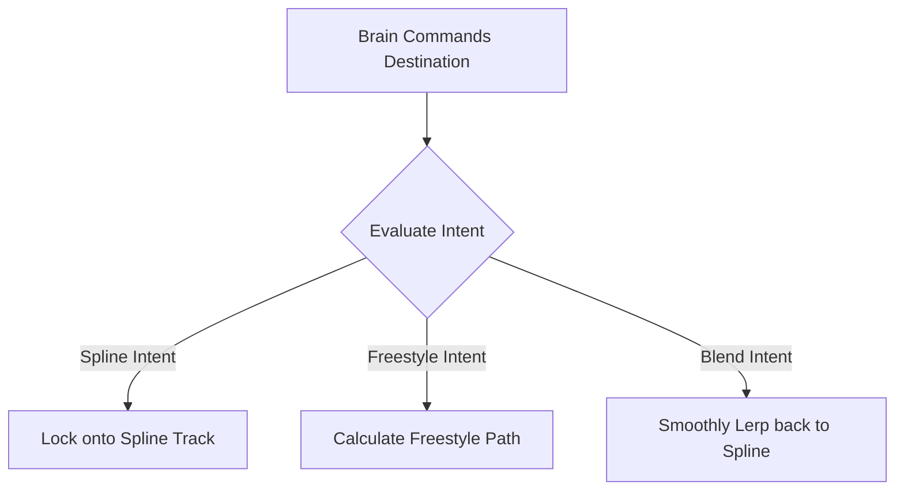

# Dragon Boss Architecture Overview & Refactoring Roadmap

This document provides a concise overview of the scripts currently driving the Dragon Boss and explicitly defines the Target Architecture we are moving toward. It exposes redundancies and maps out exactly how the legacy scripts will be folded into a clean, decoupled, node-driven system based on Quest Machine.

---

## 1. Target Architecture (The "After" Picture)

To achieve absolute separation of concerns, the monolithic scripts will be broken down into four distinct pillars. The AI logic is completely removed from C# and moved into the Quest Machine Node Graph.

### Pillar A: `QuestMachineDragonBrain`
**Player Perspective:** The invisible commander that interprets the game state and translates Quest Machine decisions into physical actions.



```text
+-----------------------------------+
|     QuestMachineDragonBrain       |
|    (Implements IDragonBrain)      |
+-----------------------------------+
| - runtimeQuestInstance: Quest     |
| - motor: BossNavigator                |
| - vitals: BossStatsAndHealth              |
+-----------------------------------+
| + OnDamageTaken(amount): void     |
| + OnStaminaDepleted(): void       |
| + HandleQuestMachineAction(): void|
+-----------------------------------+
```

### Pillar B: `BossStatsAndHealth`
**Player Perspective:** The pure health pool and stamina meter of the dragon.

```text
+-----------------------------------+
|            BossStatsAndHealth             |
| (Absorbs stats from BossCreature) |
+-----------------------------------+
| + currentHealth: float            |
| + currentStamina: float           |
| + maxHealth: float                |
+-----------------------------------+
| + TakeDamage(amount, type): void  |
| + DrainStamina(amount): void      |
| + event OnHealthThresholdReached  |
| + event OnStaminaDepleted         |
+-----------------------------------+
```
*How it removes redundancy:* Strips all AI decision-making out of the old `BossCreature`. It no longer forces evasions; it acts strictly as a sensor that fires C# events for the Brain to interpret.

### Pillar C: `BossNavigator`
**Player Perspective:** The engine that drives the dragon from point A to point B, handling the smooth transitions between riding a spline track and flying freely through the air.



```text
+-----------------------------------+
|             BossNavigator             |
| (Absorbs AirborneBossMovement)    |
+-----------------------------------+
| - currentMode: MovementMode       |
| - splineFollower: SplineFollower  |
| - targetDestination: Vector3      |
+-----------------------------------+
| + RequestSplinePath(path): void   |
| + RequestFreestyleTarget(pos):void|
| + RequestBlendToSpline(): void    |
| - TickMovement(): void            |
+-----------------------------------+
```
*How it removes redundancy:* It completely drops all logic regarding `BossPhase` or health checks. It no longer asks *why* it is moving; it only accepts explicit coordinates and intents from the Brain.

### Pillar D: `DragonSnakeMovementStyle`
**Player Perspective:** The physical trailing of the body. As the head (moved by the Navigator) flies around, this system ensures the body parts follow seamlessly, close gaps when pieces are destroyed, and wave in a snake-like manner.

```text
+-----------------------------------+
|       DragonSnakeMovementStyle       |
| (Merges SegmentedDragonManager,   |
|  DragonMovementManager, and       |
|  DragonSpacingManager)            |
+-----------------------------------+
| - positionHistory: List<PosData>  |
| - activeSegments: List<Segment>   |
| - segmentSpacing: float           |
| - isClosingGap: bool              |
+-----------------------------------+
| + InitializeAnatomy(): void       |
| - RecordHeadBreadcrumbs(): void   |
| - DragSegmentsAlongHistory(): void|
| - CalculateSegmentSpacings(): void|
| + HandleSegmentDestroyed(): void  |
+-----------------------------------+
```
*How it removes redundancy:* Completely consolidates three massive scripts into one. It does NOT care about splines, freestyle, or AI intents. It strictly monitors the root object's transform history and drags the child segments along that trail based on bounding box spacing.

---

## 2. Current State (The "Before" Picture & Redundancies)

The legacy architecture being replaced.

### The Monolithic Brain (`BossCreature.cs`)
```text
+-----------------------------------+
|            BossCreature           |
+-----------------------------------+
| - currentHealth: float            |
| - currentStamina: float           |
| + currentPhase: BossPhase         |
+-----------------------------------+
| + TakeDamage(amount, type): void  |
| + EvaluateDesires(): void         |
| + ForceImmediateEvasion(): void   |
| - EnterExhaustedPhase(): void     |
+-----------------------------------+
```
**The Flaw:** Highly coupled. Mixes state/data tracking (Vitals) with logic/decision-making.
**The Fix:** Absorbed by `BossStatsAndHealth` (for stats) and `QuestMachineDragonBrain` (for logic).

### The Overlapping Motor (`AirborneBossMovement.cs`)
```text
+-----------------------------------+
|       AirborneBossMovement        |
+-----------------------------------+
| + currentMode: MovementMode       |
| - splineFollower: SplineFollower  |
+-----------------------------------+
| + RequestFreestyleIntent(...):void|
| + RequestReturnToCoil(...): void  |
| - UpdateFreestyleMode(): void     |
| - UpdateBlendingMode(): void      |
+-----------------------------------+
```
**The Flaw:** Queries status effects directly and contains logic overlaps with the Phase enum.
**The Fix:** Absorbed by `BossNavigator`, stripped of AI queries.

### The Scattered Snake Physics
**The Flaw (Highest Redundancy):**
- `SegmentedDragonManager.cs`: Spawns parts, tracks breadcrumbs, and handles gaps.
- `DragonMovementManager.cs`: Also tracks breadcrumbs and places segments.
- `DragonSpacingManager.cs`: Calculates bounding box distances.
**The Fix:** Merged entirely into `DragonSnakeMovementStyle`. All redundant `positionHistory` tracking is unified into a single array.

### Sensors & Status Effects
- **`CreatureStatusEffects.cs`:** Manages Speed Multipliers (Ice, Stasis). Remains as a modular component read by `BossNavigator`.
- **`DesireEvaluator.cs`:** Pure math logic block. Will be deprecated; its logic moves into Quest Machine Node Conditions.
- **`BossEventBus.cs`:** The invisible network firing events (e.g., Crystal Damaged). Will be deprecated; specific sensors (Crystals) will fire events directly to the `IDragonBrain` interface.