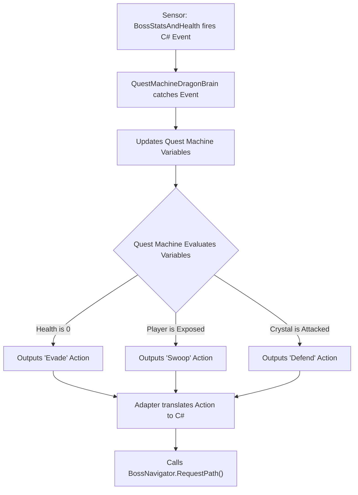
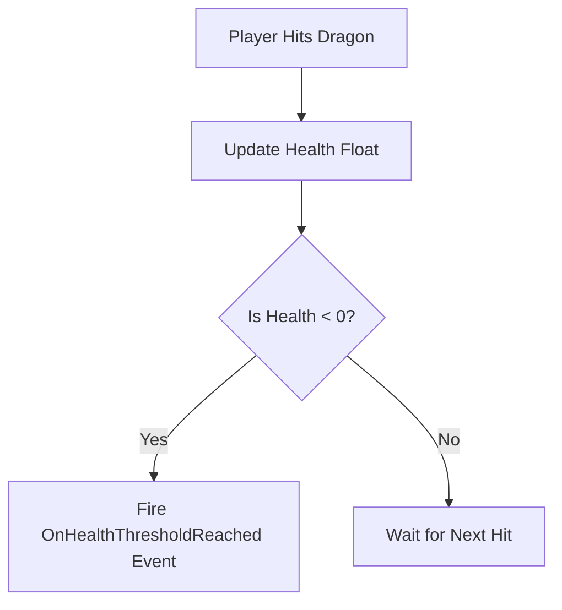
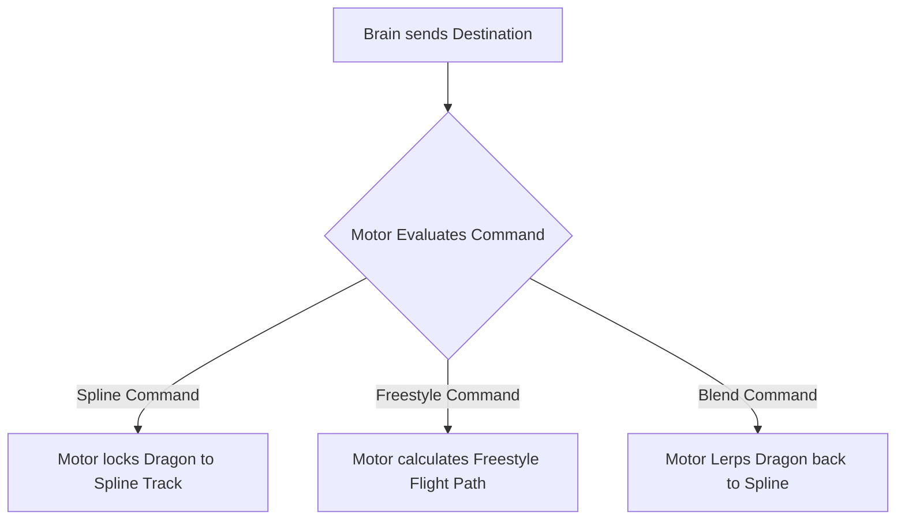
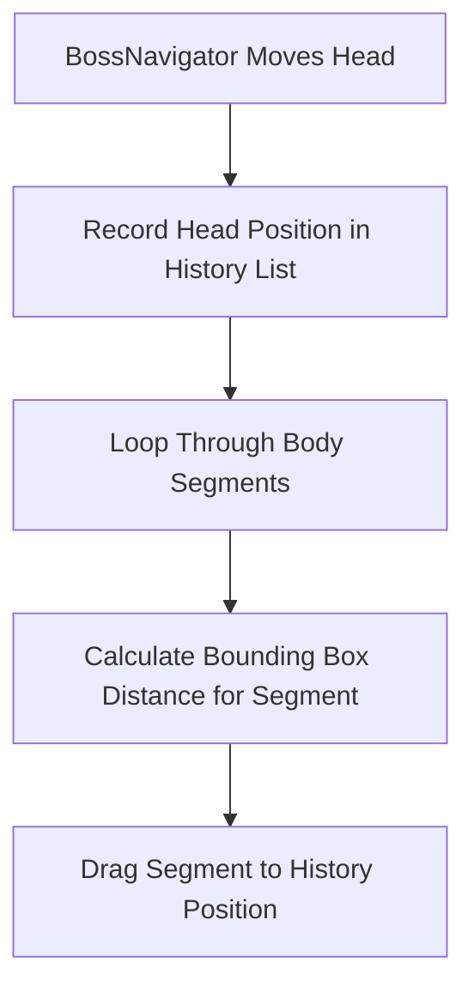

# Dragon Boss Refactor Plan

Maps Quest Machine integration. Target: Decouple AI from movement.

---

## 1. Target Architecture

Builds four core scripts.

### Pillar A: `QuestMachineDragonBrain`
**Player View:** Dragon reacts to game state. Flees when hurt. Attacks when player stops.
**Code Function:** Translates data. Catches C# events from `BossStatsAndHealth`. Updates Quest Machine Node Graph variables. Processes logic tree. Outputs action. Calls `BossNavigator` methods.
**Why:** Centralizes AI logic in visual node editor. Prevents hardcoded C# logic traps.



```text
+-----------------------------------+
|     QuestMachineDragonBrain       |
|    (Implements IDragonBrain)      |
+-----------------------------------+
| - runtimeQuestInstance: Quest     |
| - motor: BossNavigator            |
| - vitals: BossStatsAndHealth      |
+-----------------------------------+
| + OnDamageTaken(amount): void     |
| + OnStaminaDepleted(): void       |
| + HandleQuestMachineAction(): void|
+-----------------------------------+
```

### Pillar B: `BossStatsAndHealth`
**Player View:** Dragon takes damage. Loses stamina. Catches fire.
**Code Function:** Stores float variables for health and stamina. Fires C# event upon reaching zero health.
**Why:** Creates pure data container. Stops health script from forcing movement. Decouples stats from AI decisions.



```text
+-----------------------------------+
|        BossStatsAndHealth         |
+-----------------------------------+
| + currentHealth: float            |
| + currentStamina: float           |
| + maxHealth: float                |
+-----------------------------------+
| + TakeDamage(amount, type): void  |
| + DrainStamina(amount): void      |
| + event OnHealthThresholdReached  |
| + event OnStaminaDepleted         |
+-----------------------------------+
```
**Refactor Action:** Delete `BossCreature.cs` `Update()` loop. Delete AI logic. Rename file to `BossStatsAndHealth.cs`.

### Pillar C: `BossNavigator`
**Player View:** Dragon flies. Locks onto splines. Detaches from splines. Flies freely.
**Code Function:** Controls `transform.position`. Accepts Vector3 coordinate. Flies Dragon to coordinate.
**Why:** Makes movement reusable. Stops flight script from querying BossPhase. Forces Navigator to blindly obey Quest Machine coordinates.



```text
+-----------------------------------+
|           BossNavigator           |
+-----------------------------------+
| - currentMode: MovementMode       |
| - splineFollower: SplineFollower  |
| - targetDestination: Vector3      |
+-----------------------------------+
| + RequestSplinePath(path): void   |
| + RequestFreestyleTarget(pos):void|
| + RequestBlendToSpline(): void    |
| - TickMovement(): void            |
+-----------------------------------+
```
**Refactor Action:** Rewrite `AirborneBossMovement.cs`. Rename file to `BossNavigator.cs`. Delete `BossPhase` references.

### Pillar D: `DragonSnakeMovementStyle`
**Player View:** Dragon body slithers behind head. Player shoots body piece. Piece explodes. Body pieces slide forward.
**Code Function:** Handles snake physics. Records head movement. Creates history trail. Moves child body pieces along trail.
**Why:** Merges three redundant scripts into one. Eliminates duplicate history lists. Confines body physics to single file.



```text
+-----------------------------------+
|     DragonSnakeMovementStyle      |
+-----------------------------------+
| - positionHistory: List<PosData>  |
| - activeSegments: List<Segment>   |
| - segmentSpacing: float           |
| - isClosingGap: bool              |
+-----------------------------------+
| + InitializeAnatomy(): void       |
| - RecordHeadBreadcrumbs(): void   |
| - DragSegmentsAlongHistory(): void|
| - CalculateSegmentSpacings(): void|
| + HandleSegmentDestroyed(): void  |
+-----------------------------------+
```
**Refactor Action:** Delete `DragonMovementManager.cs`. Delete `DragonSpacingManager.cs`. Move math from both files into `SegmentedDragonManager.cs`. Rename `SegmentedDragonManager.cs` to `DragonSnakeMovementStyle.cs`.

---

## 2. Current Flaws & Fixes

Addresses redundant logic.

### Flaw 1: `BossCreature.cs`
**Problem:** Holds health data and AI logic. `EvaluateThreat()` method checks `currentHealth`. Method calls `movementManager.ForceImmediateEvasion()`. Logic bypasses Quest Machine.
**Fix:** Delete `EvaluateDesires()`. Delete `ForceImmediateEvasion()`. Move logic into Quest Machine Node Graph. Move health data into `BossStatsAndHealth.cs`.
**Why:** Guarantees Quest Machine acts as sole brain. Prevents hidden C# overrides from breaking boss fights.

### Flaw 2: `AirborneBossMovement.cs`
**Problem:** Controls flight and AI logic. Checks `BossCreature.currentPhase`. Checks `isTethered`.
**Fix:** Rename file to `BossNavigator.cs`. Delete phase checks. Move tether logic into `DragonSnakeMovementStyle.cs`.
**Why:** Enforces single responsibility. Navigator flies exclusively. Physics script handles tethers.

### Flaw 3: Physics Scripts
**Problem:** Three scripts drag body parts.
- `SegmentedDragonManager.cs` maintains `positionHistory` list.
- `DragonMovementManager.cs` maintains `positionHistory` list.
- `DragonSpacingManager.cs` calculates distances.
**Fix:** Delete `DragonMovementManager.cs`. Delete `DragonSpacingManager.cs`. Move math into `DragonSnakeMovementStyle.cs`.
**Why:** Removes memory waste. Stops three scripts from computing identical body segment coordinates.

### Flaw 4: Status Scripts
- **`CreatureStatusEffects.cs`:** Manages speed multipliers. Keep script. `BossNavigator.cs` reads script.
- **`DesireEvaluator.cs`:** Runs math. Delete script. Move math into Quest Machine Node Conditions. **Why:** Moves math into visual editor. Eases balancing.
- **`BossEventBus.cs`:** Fires events. Delete script. Modify `HealthCrystal.cs`. `HealthCrystal.cs` fires event to `QuestMachineDragonBrain.cs`. **Why:** Removes middleman manager. Sensors ping Brain directly.
