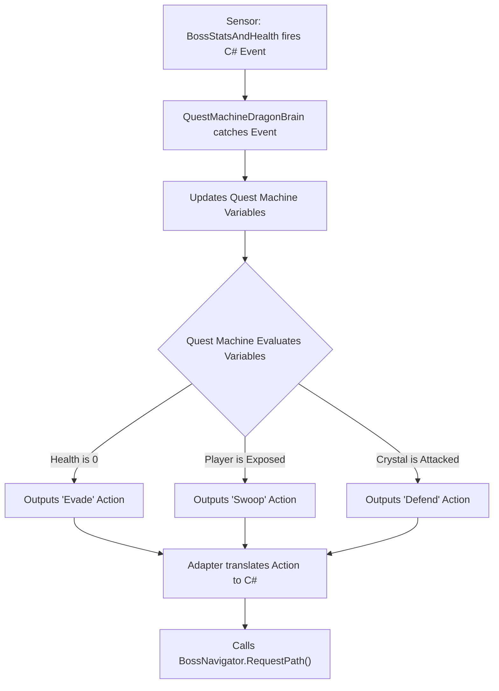
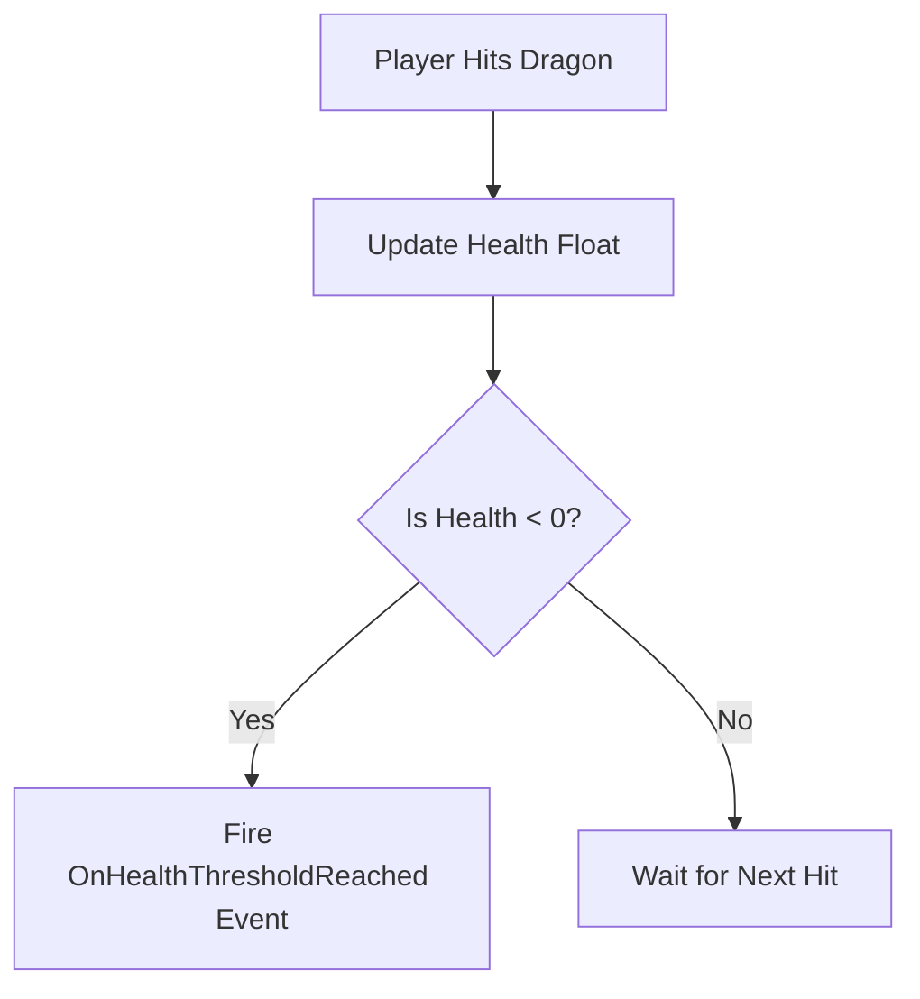
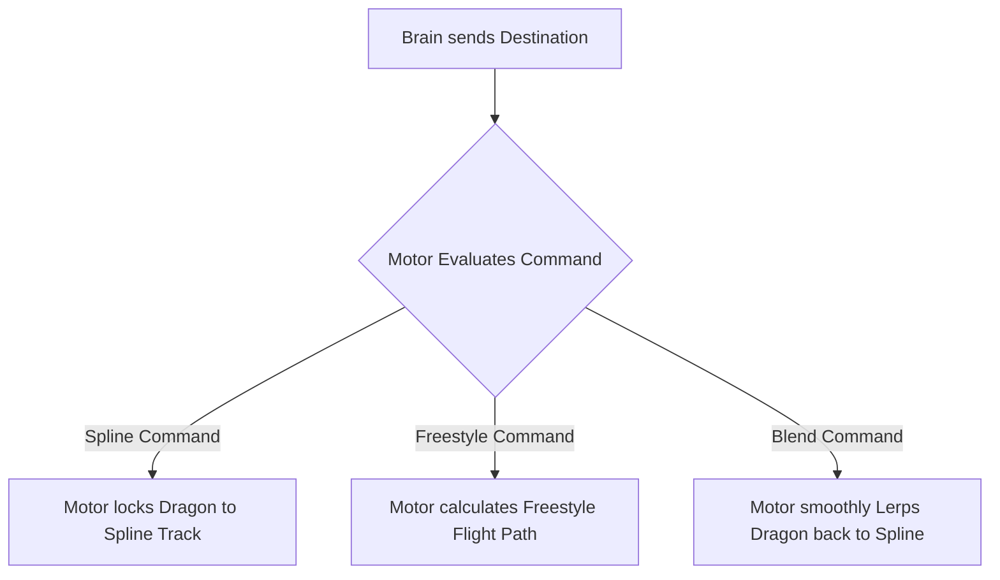
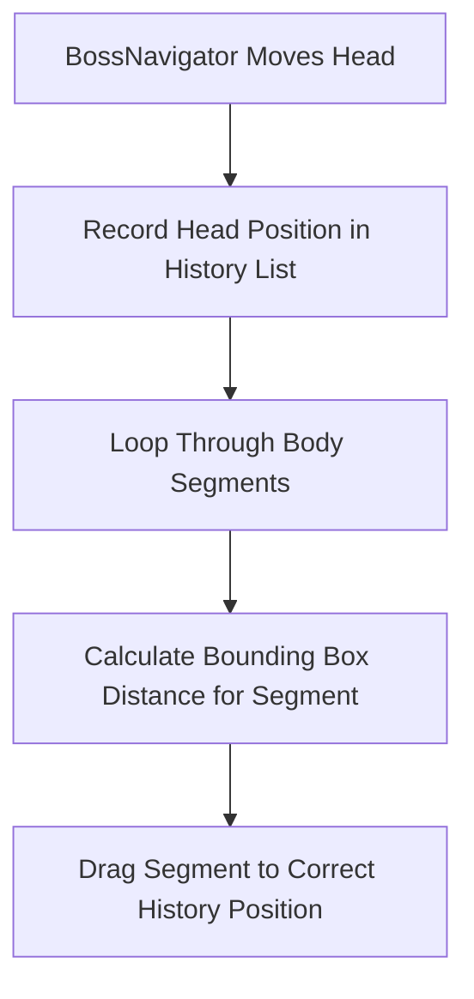

# Dragon Boss Architecture & Refactoring Briefing

This document outlines the current Dragon Boss scripts. It provides a strict map for our upcoming Quest Machine refactor. We will delete all duplicate code. We will separate the Dragon's physical body from its AI brain.

---

## 1. Target Architecture (The New Setup)

We will break the current giant scripts into four separate pillars. Quest Machine will handle all AI logic. C# scripts will only handle math and movement.

### Pillar A: `QuestMachineDragonBrain`
**What the Player Sees:** The Dragon makes smart choices. It reacts dynamically. If the player hurts it, it runs away. If the player stands still, it attacks.
**What the Code Does:** This script acts as a translator. It receives data from the `BossStatsAndHealth` script (like "Stamina is 0"). It sends that data into the Quest Machine Node Graph. Quest Machine runs its logic tree. Quest Machine outputs a decision (like "Swoop"). This script then tells `BossNavigator` where to fly.



```text
+-----------------------------------+
|     QuestMachineDragonBrain       |
|    (Implements IDragonBrain)      |
+-----------------------------------+
| - runtimeQuestInstance: Quest     |
| - motor: BossNavigator            |
| - vitals: BossStatsAndHealth      |
+-----------------------------------+
| + OnDamageTaken(amount): void     |
| + OnStaminaDepleted(): void       |
| + HandleQuestMachineAction(): void|
+-----------------------------------+
```

### Pillar B: `BossStatsAndHealth`
**What the Player Sees:** The Dragon takes damage. The Dragon loses stamina when it attacks. The Dragon catches on fire.
**What the Code Does:** This script is a pure data container. It holds the float variables for health and stamina. When health hits zero, this script fires a C# event.



```text
+-----------------------------------+
|        BossStatsAndHealth         |
+-----------------------------------+
| + currentHealth: float            |
| + currentStamina: float           |
| + maxHealth: float                |
+-----------------------------------+
| + TakeDamage(amount, type): void  |
| + DrainStamina(amount): void      |
| + event OnHealthThresholdReached  |
| + event OnStaminaDepleted         |
+-----------------------------------+
```
**The Refactor Action:** We will take `BossCreature.cs`. We will delete its `Update()` loop. We will delete its AI logic. We will rename it to `BossStatsAndHealth.cs`. It will never force the Dragon to move. It will only shout "My health is low!" into the void.

### Pillar C: `BossNavigator`
**What the Player Sees:** The Dragon flies through the air. It locks onto invisible tracks (splines) to recharge. It seamlessly detaches from those tracks to fly freely (freestyle) when it attacks.
**What the Code Does:** This script is the engine. It controls `transform.position`. It accepts a Vector3 coordinate. It flies the Dragon to that coordinate.



```text
+-----------------------------------+
|           BossNavigator           |
+-----------------------------------+
| - currentMode: MovementMode       |
| - splineFollower: SplineFollower  |
| - targetDestination: Vector3      |
+-----------------------------------+
| + RequestSplinePath(path): void   |
| + RequestFreestyleTarget(pos):void|
| + RequestBlendToSpline(): void    |
| - TickMovement(): void            |
+-----------------------------------+
```
**The Refactor Action:** We will take `AirborneBossMovement.cs`. We will rename it to `BossNavigator.cs`. We will delete its references to `BossPhase`. It will stop thinking. It will only follow coordinate orders from the Brain.

### Pillar D: `DragonSnakeMovementStyle`
**What the Player Sees:** The Dragon has a long body. The body slithers perfectly behind the head. If the player shoots a body piece, the piece explodes. The remaining body pieces slide forward smoothly to close the gap.
**What the Code Does:** This script handles the snake physics. It records exactly where the Head has traveled. It creates a breadcrumb trail. It drags the child body pieces along that exact trail.



```text
+-----------------------------------+
|     DragonSnakeMovementStyle      |
+-----------------------------------+
| - positionHistory: List<PosData>  |
| - activeSegments: List<Segment>   |
| - segmentSpacing: float           |
| - isClosingGap: bool              |
+-----------------------------------+
| + InitializeAnatomy(): void       |
| - RecordHeadBreadcrumbs(): void   |
| - DragSegmentsAlongHistory(): void|
| - CalculateSegmentSpacings(): void|
| + HandleSegmentDestroyed(): void  |
+-----------------------------------+
```
**The Refactor Action:** We currently use three scripts to do this one job. We will delete `DragonMovementManager.cs`. We will delete `DragonSpacingManager.cs`. We will move all their math into `SegmentedDragonManager.cs`. We will rename `SegmentedDragonManager.cs` to `DragonSnakeMovementStyle.cs`. This single script will hold one `positionHistory` list. It will handle all body spacing and gap closing.

---

## 2. Current State (The Old Code To Delete)

This section details the specific flaws in the old code. We will fix these flaws during the refactor.

### Flaw 1: The Monolithic Brain (`BossCreature.cs`)
**The Problem:** `BossCreature.cs` holds health data AND AI logic. Inside the `EvaluateThreat()` method, the script checks if `currentHealth` is low. If health is low, the script directly calls `movementManager.ForceImmediateEvasion()`. This hardcoded C# logic completely bypasses our Quest Machine setup.
**The Fix:** We will delete `EvaluateDesires()`. We will delete `ForceImmediateEvasion()`. We will move this logic into the visual Quest Machine Node Graph. We will turn the remaining health data into `BossStatsAndHealth.cs`.

### Flaw 2: The Overlapping Motor (`AirborneBossMovement.cs`)
**The Problem:** `AirborneBossMovement.cs` controls flight, but it also tries to be smart. It checks `BossCreature.currentPhase` to decide how to fly. It also checks `isTethered` and applies its own rubber-band math.
**The Fix:** We will rename this script to `BossNavigator.cs`. We will delete all phase checks. We will move the tether logic into `DragonSnakeMovementStyle.cs`. The Navigator will only accept destinations.

### Flaw 3: The Scattered Snake Physics
**The Problem:** We currently run three redundant scripts to drag the body parts.
- `SegmentedDragonManager.cs` maintains a `positionHistory` list to drag parts.
- `DragonMovementManager.cs` maintains an identical `positionHistory` list and does the exact same thing.
- `DragonSpacingManager.cs` calculates the bounding box distances.
**The Fix:** We will delete `DragonMovementManager.cs`. We will delete `DragonSpacingManager.cs`. We will move their math into `DragonSnakeMovementStyle.cs`.

### Flaw 4: Sensors & Status Effects
- **`CreatureStatusEffects.cs`:** This manages Speed Multipliers (Ice, Stasis). We will keep this script. `BossNavigator.cs` will read this script to slow down the Dragon.
- **`DesireEvaluator.cs`:** This script runs math to decide what the boss wants. We will delete this script. We will put this math directly into the Quest Machine Node Conditions.
- **`BossEventBus.cs`:** This script tells the game when a Crystal takes damage. We will delete this script. We will modify `HealthCrystal.cs`. When shot, `HealthCrystal.cs` will fire an event directly to the `QuestMachineDragonBrain.cs` script.