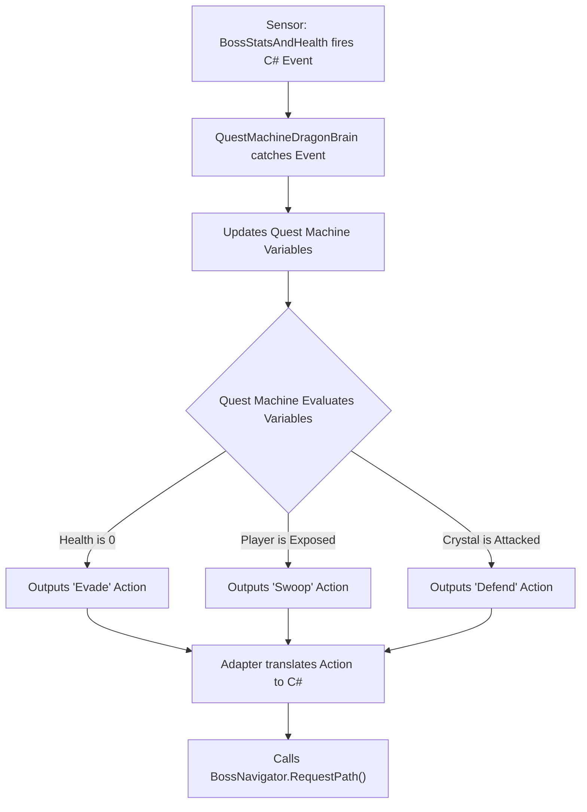
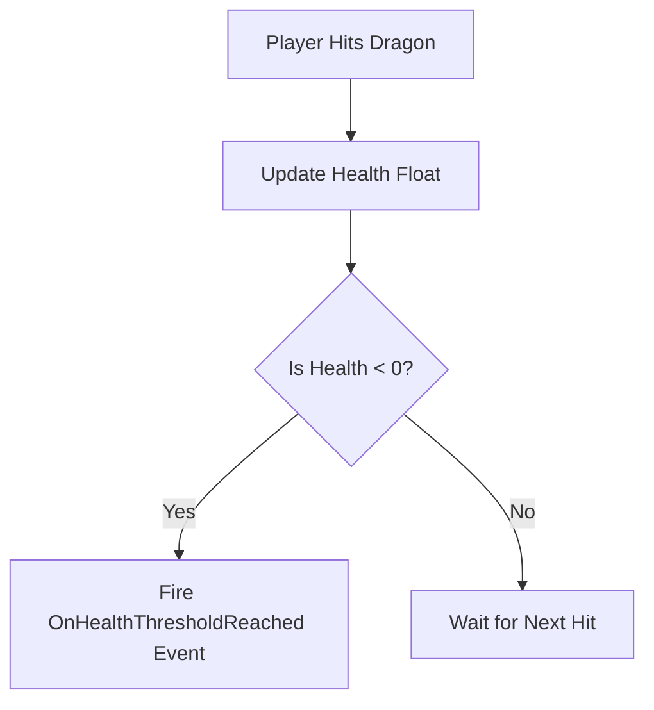
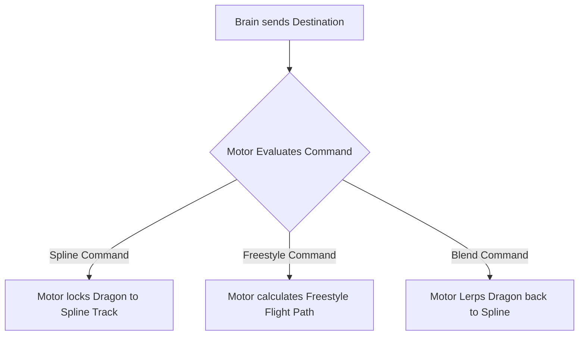
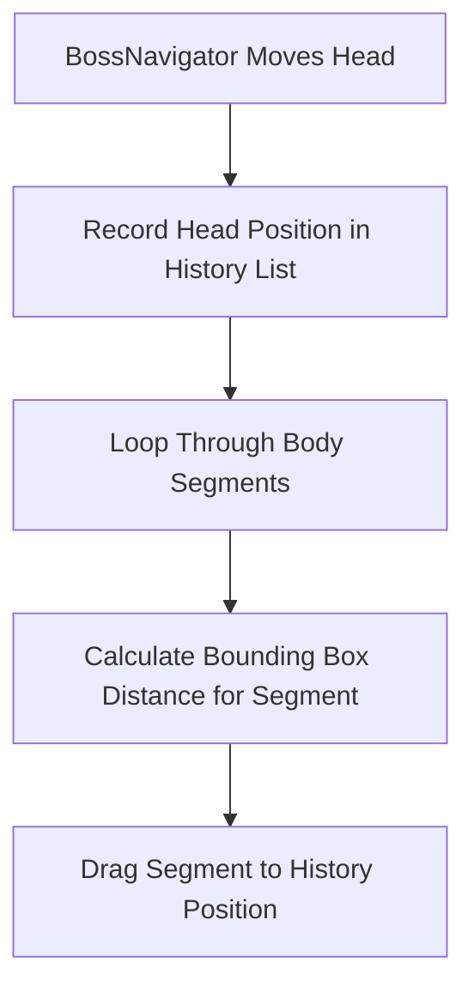

# Dragon Boss Refactoring Document

This document maps the Quest Machine refactor. We will rewrite `BossCreature.cs`, `AirborneBossMovement.cs`, `SegmentedDragonManager.cs`, `DragonMovementManager.cs`, and `DragonSpacingManager.cs`. We will move AI logic into Quest Machine. We will move math and movement into C# scripts.

---

## 1. Target Architecture

We will build four scripts.

### Pillar A: `QuestMachineDragonBrain`
**Player View:** The Dragon reacts to the game state. It runs away when hurt. It attacks when the player stands still.
**Code Function:** This script translates data. It receives C# events from `BossStatsAndHealth`. It sends data to the Quest Machine Node Graph. Quest Machine runs the logic tree. Quest Machine outputs an action. This script tells `BossNavigator` where to fly.



```text
+-----------------------------------+
|     QuestMachineDragonBrain       |
|    (Implements IDragonBrain)      |
+-----------------------------------+
| - runtimeQuestInstance: Quest     |
| - motor: BossNavigator            |
| - vitals: BossStatsAndHealth      |
+-----------------------------------+
| + OnDamageTaken(amount): void     |
| + OnStaminaDepleted(): void       |
| + HandleQuestMachineAction(): void|
+-----------------------------------+
```

### Pillar B: `BossStatsAndHealth`
**Player View:** The Dragon takes damage. The Dragon loses stamina. The Dragon catches on fire.
**Code Function:** This script holds data. It holds float variables for health and stamina. Health hits zero. This script fires a C# event.



```text
+-----------------------------------+
|        BossStatsAndHealth         |
+-----------------------------------+
| + currentHealth: float            |
| + currentStamina: float           |
| + maxHealth: float                |
+-----------------------------------+
| + TakeDamage(amount, type): void  |
| + DrainStamina(amount): void      |
| + event OnHealthThresholdReached  |
| + event OnStaminaDepleted         |
+-----------------------------------+
```
**Refactor Action:** We will rewrite `BossCreature.cs`. We will delete the `Update()` loop. We will delete AI logic. We will rename the file to `BossStatsAndHealth.cs`.

### Pillar C: `BossNavigator`
**Player View:** The Dragon flies. It locks onto splines. It detaches from splines. It flies freely.
**Code Function:** This script controls `transform.position`. It accepts a Vector3 coordinate. It flies the Dragon to the coordinate.



```text
+-----------------------------------+
|           BossNavigator           |
+-----------------------------------+
| - currentMode: MovementMode       |
| - splineFollower: SplineFollower  |
| - targetDestination: Vector3      |
+-----------------------------------+
| + RequestSplinePath(path): void   |
| + RequestFreestyleTarget(pos):void|
| + RequestBlendToSpline(): void    |
| - TickMovement(): void            |
+-----------------------------------+
```
**Refactor Action:** We will rewrite `AirborneBossMovement.cs`. We will rename the file to `BossNavigator.cs`. We will delete references to `BossPhase`.

### Pillar D: `DragonSnakeMovementStyle`
**Player View:** The Dragon body slithers behind the head. The player shoots a body piece. The piece explodes. The body pieces slide forward.
**Code Function:** This script handles snake physics. It records head movement. It creates a history trail. It moves child body pieces along the trail.



```text
+-----------------------------------+
|     DragonSnakeMovementStyle      |
+-----------------------------------+
| - positionHistory: List<PosData>  |
| - activeSegments: List<Segment>   |
| - segmentSpacing: float           |
| - isClosingGap: bool              |
+-----------------------------------+
| + InitializeAnatomy(): void       |
| - RecordHeadBreadcrumbs(): void   |
| - DragSegmentsAlongHistory(): void|
| - CalculateSegmentSpacings(): void|
| + HandleSegmentDestroyed(): void  |
+-----------------------------------+
```
**Refactor Action:** We will delete `DragonMovementManager.cs`. We will delete `DragonSpacingManager.cs`. We will move math from both files into `SegmentedDragonManager.cs`. We will rename `SegmentedDragonManager.cs` to `DragonSnakeMovementStyle.cs`.

---

## 2. Current State

We will fix flaws in the old code.

### Flaw 1: `BossCreature.cs`
**Problem:** `BossCreature.cs` holds health data and AI logic. The `EvaluateThreat()` method checks if `currentHealth` is low. The method calls `movementManager.ForceImmediateEvasion()`. This logic bypasses Quest Machine.
**Fix:** We will delete `EvaluateDesires()`. We will delete `ForceImmediateEvasion()`. We will move logic into the Quest Machine Node Graph. We will move health data into `BossStatsAndHealth.cs`.

### Flaw 2: `AirborneBossMovement.cs`
**Problem:** `AirborneBossMovement.cs` controls flight and AI logic. It checks `BossCreature.currentPhase`. It checks `isTethered`.
**Fix:** We will rename the file to `BossNavigator.cs`. We will delete phase checks. We will move tether logic into `DragonSnakeMovementStyle.cs`.

### Flaw 3: Physics Scripts
**Problem:** Three scripts drag body parts.
- `SegmentedDragonManager.cs` maintains a `positionHistory` list.
- `DragonMovementManager.cs` maintains a `positionHistory` list.
- `DragonSpacingManager.cs` calculates distances.
**Fix:** We will delete `DragonMovementManager.cs`. We will delete `DragonSpacingManager.cs`. We will move math into `DragonSnakeMovementStyle.cs`.

### Flaw 4: Status Scripts
- **`CreatureStatusEffects.cs`:** This script manages speed multipliers. We will keep this script. `BossNavigator.cs` will read this script.
- **`DesireEvaluator.cs`:** This script runs math. We will delete this script. We will put math into Quest Machine Node Conditions.
- **`BossEventBus.cs`:** This script fires events. We will delete this script. We will modify `HealthCrystal.cs`. `HealthCrystal.cs` will fire an event to `QuestMachineDragonBrain.cs`.
