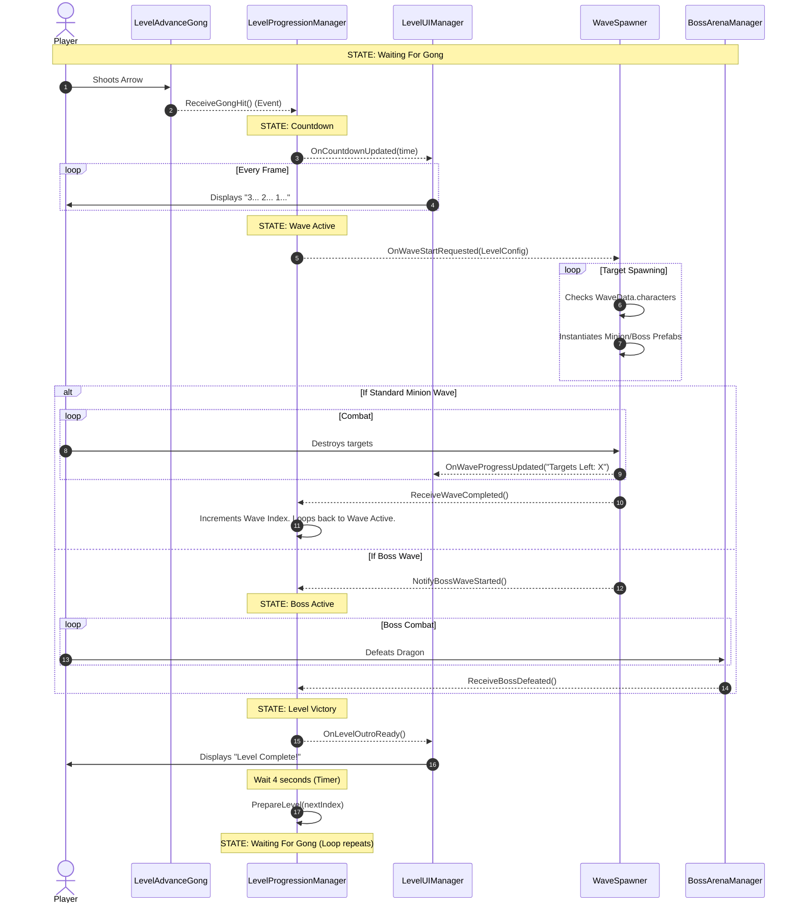

# Level Progression Core Loop

> [!info] Architecture Overview
> This diagram illustrates the **Event-Driven Progression Loop** from the player's perspective, mapping how hitting the Gong triggers the state machine, which sequentially fires instructions to the UI and Spawner without relying on Coroutines.

